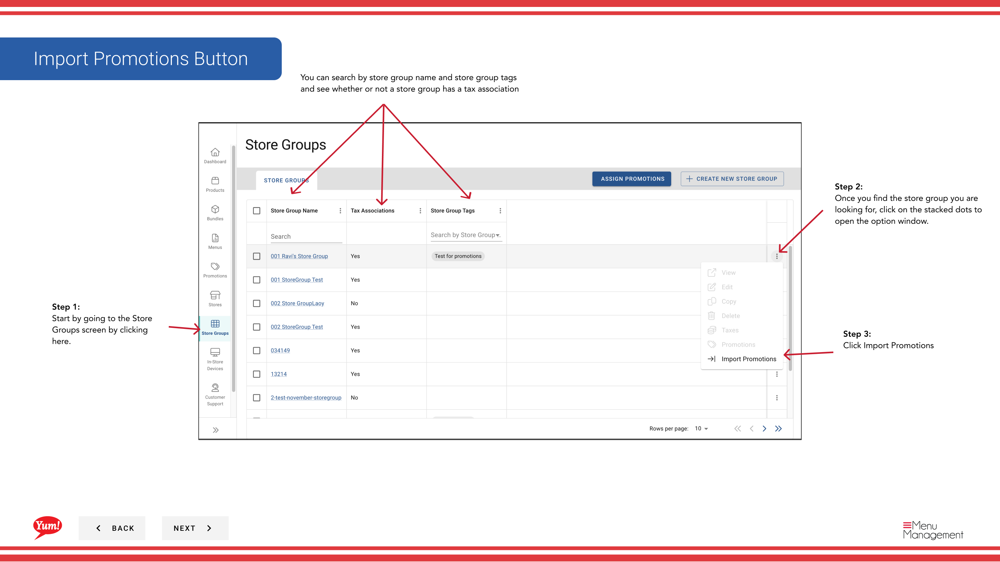
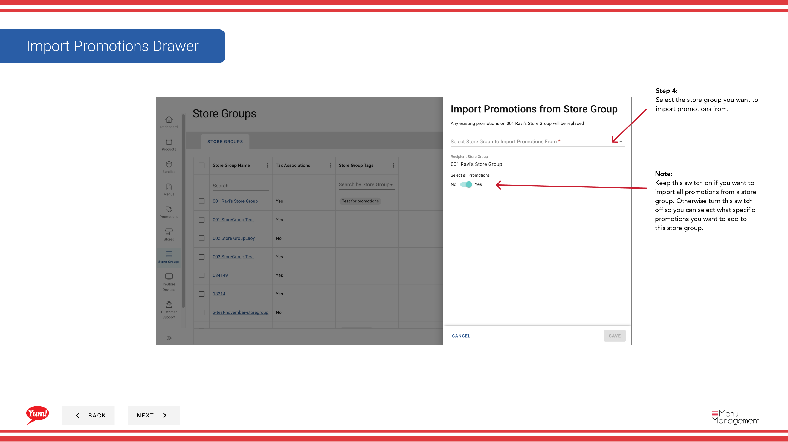
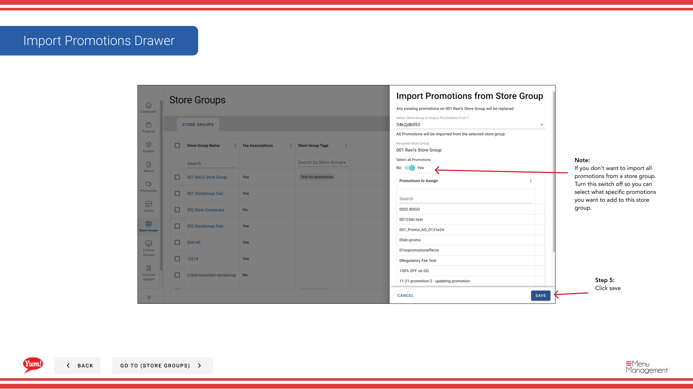

# Promotions d'importation pour un groupe de magasins

## Ce que ce guide couvre

Affectations de promotion d'importations en vrac d'un groupe de magasins à un autre pour la configuration à grande échelle de la campagne ou la duplication de configuration.

## Étapes

**Step 1:** Naviguez vers la section **Groupes de magasins** en utilisant le menu de navigation de gauche.

**Step 2:** Trouvez le groupe de magasins qui recevra** les promotions (le groupe de destination). Cliquez sur le bouton de menu **action** (trois points) à côté du nom du groupe de magasins.

**Step 3:** Cliquez sur **Importer les Promotions** dans le menu déroulant.

**Step 4:** Un dialogue s'ouvrira. Sélectionnez le groupe de magasins que vous souhaitez importer des promotions **de** (le groupe source). Vous pouvez le rechercher en utilisant la barre de recherche.

**Step 5 (Optional):** Décider s'il faut importer toutes les promotions ou certaines :

| Option | Décision |
|--------|--------|
| **Importer tous** | Laissez le toggle ON importer chaque promotion du groupe source |
| **Particulier à l'importation** | Désactivez le commutateur "Importer tout", puis cochez les cases à côté des promotions que vous voulez importer |

**Step 6:** Consultez le résumé de l'importation et cliquez sur **Enregistrer** pour compléter l'importation.

:::caution
**Important:** Les promotions d'importation seront **remplacer** toute promotion existante liée au groupe de magasins de destination. Cette action ne peut être annulée. Assurez-vous d'importer au bon groupe de magasins avant de confirmer.
:::

:::tip
Si vous voulez seulement ajouter des promotions spécifiques sans les remplacer, utilisez le[Modifier les promotions](/docs/admin-portal-guide/store-groups/edit-promotions/)à la place.
:::

## Guides connexes

- [Affecter des promotions](/docs/admin-portal-guide/store-groups/assign-promotions/)
- [Modifier les promotions](/docs/admin-portal-guide/store-groups/edit-promotions/)
- [Désigner les promotions du groupe Store](/docs/admin-portal-guide/store-groups/unassign-promotions-from-store-group/)

---

* Une partie des[Guide du portail administratif](/docs/admin-portal-guide)· Section : Groupes de magasins*