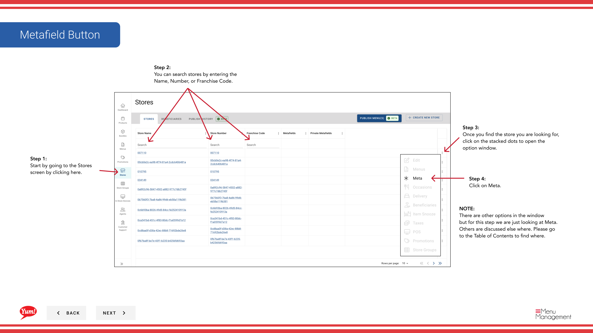
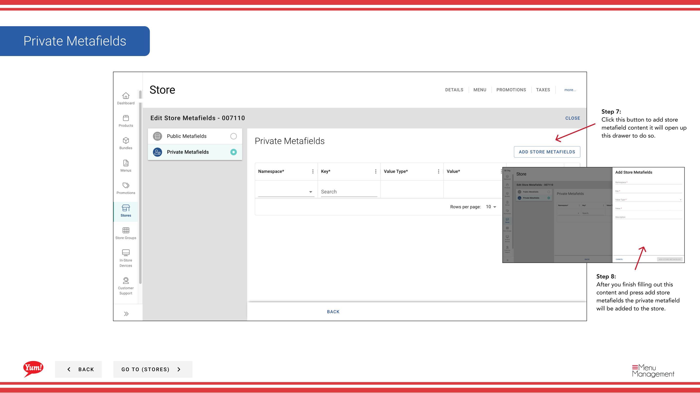

# Ajouter des champs de métadonnées à un menu

## Ce que ce guide couvre

Joindre des métadonnées personnalisées publiques et privées (paires de valeurs clés) au menu d'un magasin pour l'intégration avec des systèmes en aval ou des exigences spécifiques au marché.

## Étapes

**Step 1:** Naviguez dans la section **Stores** en utilisant le menu de navigation de gauche.

**Step 2:** Recherchez le magasin par **Nom**, **Numéro de magasin** ou **Code de franchise** à l'aide de la boîte de recherche.

**Step 3:** Une fois que vous trouvez le magasin, cliquez sur le menu ** à trois points** (••) pour ouvrir le menu des options.

**Step 4:** Cliquez sur **Meta** dans le menu déroulant. Ceci ouvre l'écran de gestion des métachamps.

**Step 5 - Public Metafields:** Cliquez sur le bouton **Ajouter un champ public** pour ajouter un champ public.

**Step 6:** Remplissez les détails du métachamp :

| Champ | Quoi entrer | Annexe |
|-------|--------------|-------|
| * Clé * | Nom ou identifiant du champ | Par exemple, "api version", "intégration id" |
| **Valeur** * | La valeur du champ | Par exemple, "v2", "12345" |

**Step 7:** Cliquez sur **Ajouter des Métafields de magasin** pour sauvegarder le Métafield public.

**Step 8 - Private Metafields:** Cliquez sur le bouton **Ajouter un champ privé** pour ajouter un champ privé.

**Step 9:** Remplissez les détails du métachamp en utilisant la même structure de champ que ci-dessus.

**Step 10:** Cliquez sur **Ajouter des Métafields de Store** pour enregistrer le métafield privé.

:::note :
**When to use metafields:** Ajouter des métachamps seulement si votre équipe technique a spécifié des paires de valeurs clés pour l'intégration du système. Les métachamps publics sont visibles par des systèmes externes; les métachamps privés sont destinés à une utilisation interne seulement.
:::

:::tip
Vous n'avez pas besoin d'ajouter des métachamps publics et privés. Ajouter uniquement les métachamps requis pour les intégrations de votre magasin.
:::

## Guides connexes

- [Afficher le menu d'un magasin](/docs/admin-portal-guide/stores/view-a-stores-menu/)— Voir l'attribution des menus

---

* Une partie des[Guide du portail administratif](/docs/admin-portal-guide)· Section: Magasins*