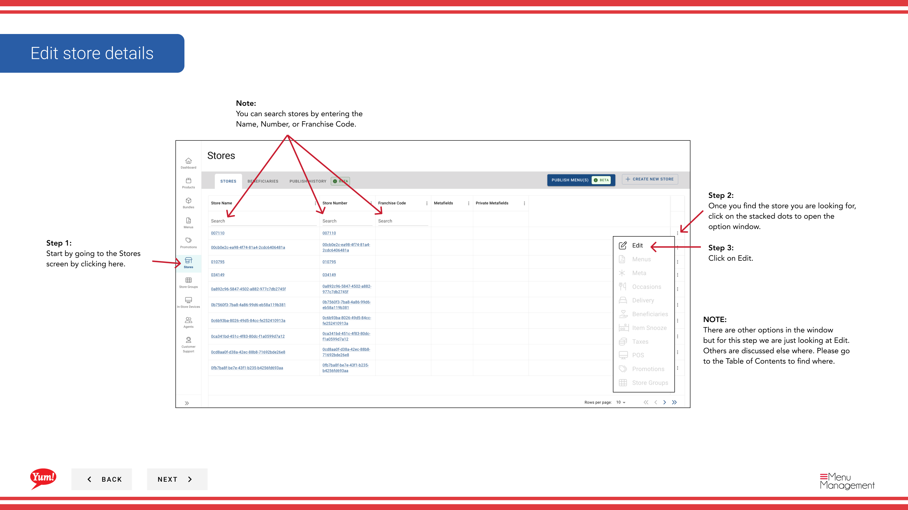

# Modifier les détails du magasin

## Ce que ce guide couvre

Mettre à jour les informations d'un magasin existant comme le nom, les paramètres ou les champs opérationnels.

## Étapes

**Step 1:** Naviguez dans la section **Stores** en utilisant le menu de navigation de gauche.

**Step 2:** Recherchez le magasin par **Nom**, **Numéro de magasin** ou **Code de franchise** à l'aide de la boîte de recherche.

**Step 3:** Une fois que vous trouvez le magasin, cliquez sur l'icône ** menu à trois points** (•••) de la ligne du magasin pour ouvrir le menu options.

**Step 4:** Cliquez sur **Edit** dans le menu déroulant.

**Step 5:** Mettre à jour les champs de stockage au besoin. Voir les descriptions de champ ci-dessous. Tous les champs marqués d'un * sont obligatoires.

| Champ | Quoi entrer | Annexe |
|-------|--------------|-------|
| **Nom du magasin** * | Affichage complet du nom du magasin | Par exemple, KFC George Street Sydney |
| ** Numéro du magasin** * | Identifiant numérique unique attribué par les opérations de marché | Doit correspondre au numéro de magasin attribué par Byte POS, ou à l'identificateur de magasin cartographié utilisé par Byte Connect pour les marchés de points de vente non attribués par Byte |
| **Code de la franchise** * | Code alphanumérique identifiant le franchisé | Fourni par votre gestionnaire régional |
| **Délai** | Le fuseau horaire local du magasin | Requis pour l'article snooze et la précision future de la commande |
| **Accepter les commandes en ligne** | Toggle: Oui ou Non | Réglé à Non pendant les fermetures ou les problèmes opérationnels |
| **Appareil en magasin Résultats de la recherche** | Toggle: Oui ou Non | Set to No pour masquer un emplacement sans le supprimer |
| **Offre des ordres futurs** | Toggle: Oui ou Non | Permet aux clients de passer des commandes préalables; nécessite un canal pris en charge |

**Step 6:** Une fois toutes les modifications terminées, le bouton **Save** devient actif. Cliquez sur **Enregistrer** pour mettre à jour le magasin.

:::note Octet POS Cavat
Mettre à jour les détails du magasin ne crée pas en soi une connectivité directe entre Byte Commerce et un POS non-octet. Si le marché n'est pas sur Byte POS, **Byte Connect** est le pont requis.
:::

:::caution
Cliquez sur **Annuler** à tout moment rejette tous les changements non enregistrés.
:::

## Guides connexes

- [Créer un magasin](/docs/admin-portal-guide/stores/create-a-store/)— Enregistrer un nouveau magasin
- [Accepter les commandes en ligne (déplacer ou désactiver)](/docs/admin-portal-guide/stores/2a-accept-online-orders-turn-on-or-off/)— Ne pas accepter séparément la commande

---

* Une partie des[Guide du portail administratif](/docs/admin-portal-guide)· Section: Magasins*
