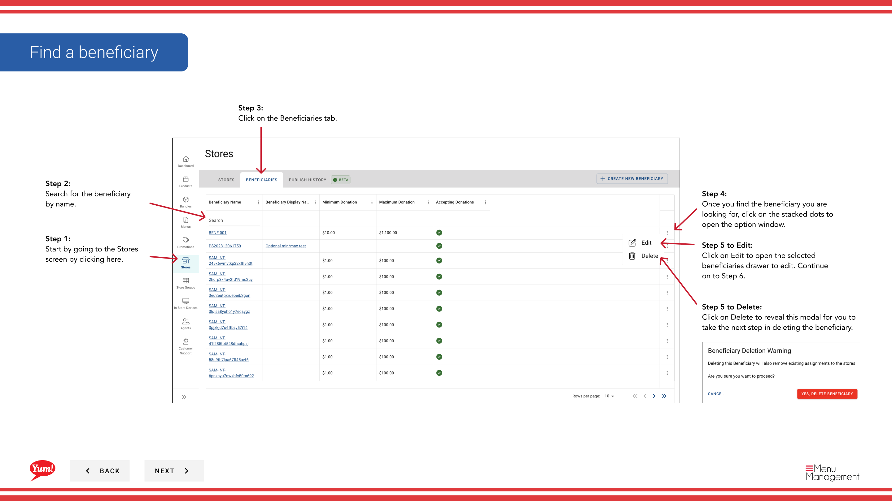

# Modifier/supprimer un bénéficiaire

## Ce que ce guide couvre

Mettre à jour ou supprimer un dossier de bénéficiaire existant, y compris son nom, son statut de don et les magasins associés.

## Étapes

**Step 1:** Naviguez dans la section **Stores** en utilisant le menu de navigation de gauche.

**Step 2:** Cliquez sur l'onglet **Bénéficiaires** en haut de la page Boutiques.

**Step 3:** Utilisez la boîte de recherche pour trouver le bénéficiaire par **nom**, ou faites défiler la liste.

**Step 4:** Une fois que vous trouvez le bénéficiaire, cliquez sur l'icône ** menu à trois points** (•••) de la ligne du bénéficiaire pour ouvrir le menu des options.

### Pour modifier :

**Step 5:** Cliquez sur **Modifier** pour ouvrir le formulaire de détails du bénéficiaire.

**Step 6:** Mettre à jour les champs bénéficiaires au besoin. Tous les champs marqués d'un * sont obligatoires.

| Champ | Quoi entrer | Annexe |
|-------|--------------|-------|
| **Nom du bénéficiaire** * | Nom de l'organisme ou de la cause | Par exemple, Fondation jeunesse de la KFC |
| **Acceptation des dons** | Toggle: Oui ou Non | Contrôle de l'activité des dons |
| ** Magasins associés** | Sélection des magasins | Utilisez la recherche pour ajouter ou supprimer des magasins de ce bénéficiaire |

**Step 7:** Une fois les modifications terminées, cliquez sur **Enregistrer** pour mettre à jour le bénéficiaire.

### Pour supprimer :

**Step 5:** Cliquez sur **Supprimer** dans le menu Options.

**Step 6:** Confirmez la suppression dans le modal qui apparaît en cliquant sur **Supprimer** à nouveau. Cette action ne peut être annulée.

:::caution
La suppression d'un bénéficiaire ne peut être annulée. Pour désactiver temporairement un bénéficiaire, définissez **Accepter les dons** à **Non**.
:::

:::caution
Cliquer sur **Annuler** à tout moment supprime les modifications non enregistrées (Modifier seulement).
:::

## Guides connexes

- [Voir les bénéficiaires d'un magasin](/docs/admin-portal-guide/stores/view-a-stores-beneficiaries/)— Voir tous les bénéficiaires liés à un magasin
- [Créer un bénéficiaire](/docs/admin-portal-guide/stores/create-a-beneficiary/)— Créer un nouveau bénéficiaire

---

* Une partie des[Guide du portail administratif](/docs/admin-portal-guide)· Section: Magasins*