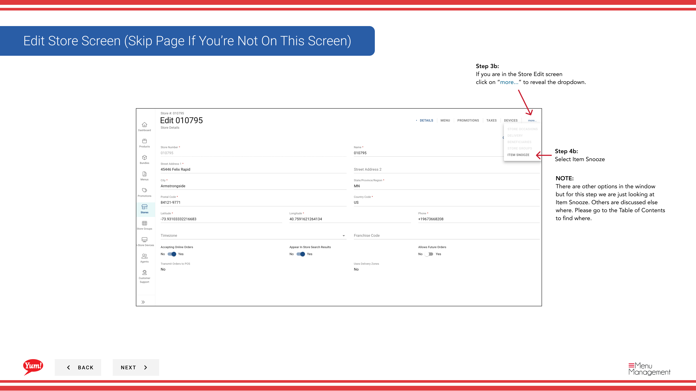

# Point Snooze

## Ce que ce guide couvre

Supprime temporairement un élément spécifique d'un menu store pour une période et une raison définies (p. ex. panne de stock ou panne d'équipement), ce qui lui permet de revenir automatiquement à la fin de la période snooze.

## Étapes

**Step 1:** Naviguez dans la section **Stores** en utilisant le menu de navigation de gauche.

**Step 2:** Recherchez le magasin par **Nom**, **Numéro de magasin** ou **Code de franchise** à l'aide de la boîte de recherche.

**Step 3:** Une fois que vous trouvez le magasin, cliquez sur le menu ** à trois points** (••) pour ouvrir le menu des options.

**Step 4:** Cliquez sur **Item Snooze** dans le menu déroulant. Si vous ne voyez pas cette option immédiatement, cliquez sur le bouton **more** pour révéler des options supplémentaires.

**Step 5:** Cliquez sur le bouton **+ Ajouter l'élément** pour balayer un nouvel élément.

**Step 6:** Remplissez le formulaire snooze en utilisant les descriptions de champs ci-dessous. Les champs marqués d'un * sont obligatoires.

| Champ | Quoi entrer | Annexe |
|-------|--------------|-------|
| **Type d'article** * | Sélectionnez dans le menu déroulant | Habituellement, le produit ou le bundle |
| ** Point** * | Rechercher et sélectionner l'élément à snooze | Saisissez au moins 3 caractères à rechercher. Par exemple : |
| **Date de fin** * | Date et heure du retour de l'élément au menu | Le snooze commence immédiatement lorsqu'il est enregistré; il ne peut pas être programmé pour un départ futur |
| **Réason** * | Sélectionnez dans le menu déroulant | Par exemple, hors stock, panne d'équipement, enlèvement temporaire |
| **Ajouter des détails** | Explication facultative en texte libre | Par exemple, la livraison du fournisseur est reportée à vendredi. |

**Step 7:** Une fois que tous les champs requis sont remplis, cliquez sur **Enregistrer** pour activer le snooze.

:::caution
- Le snooze prend effet **immédiatement** lorsque vous cliquez sur Enregistrer — il ne peut pas être programmé pour commencer plus tard.
- Si votre magasin **Time Zone** n'est pas configuré, vous devez le définir avant de créer des éléments snoozed.
:::

:::tip
Utilisez le champ **Ajouter des détails** pour documenter les raisons pour lesquelles l'article a été balayé. Cela aide d'autres gestionnaires à comprendre la raison de l'affichage d'articles snoozed plus tard.
:::

## Guides connexes

- [Modifier les détails du magasin](/docs/admin-portal-guide/stores/edit-store-details/)— Configurez votre magasin
- [Affichage d'un menu Store](/docs/admin-portal-guide/stores/view-a-stores-menu/)— Voir tous les articles et leur statut snooze

---

* Une partie des[Guide du portail administratif](/docs/admin-portal-guide)· Section: Magasins*