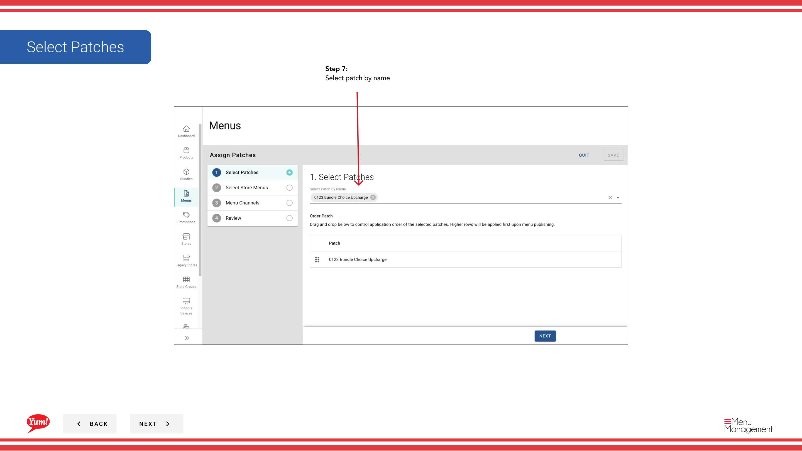
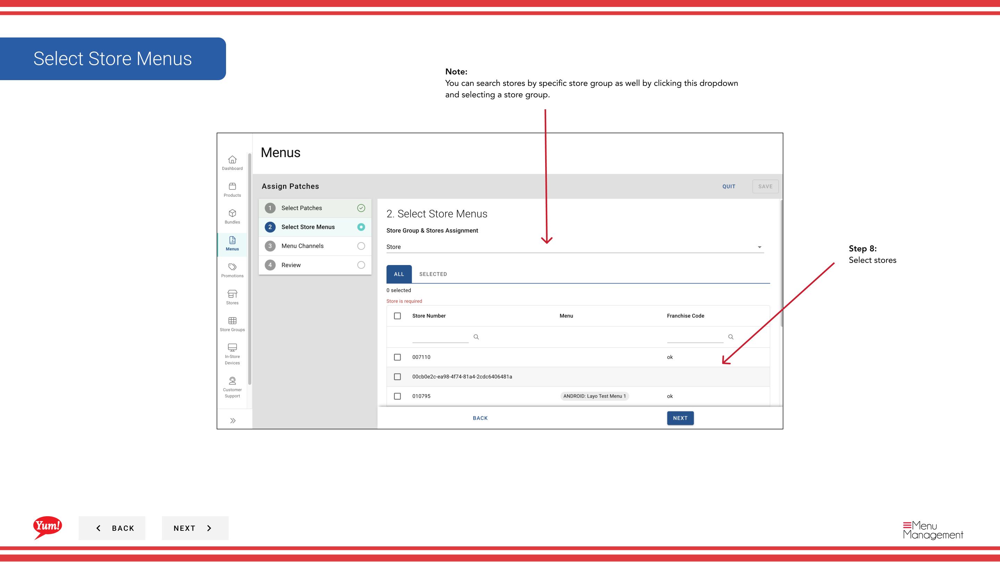
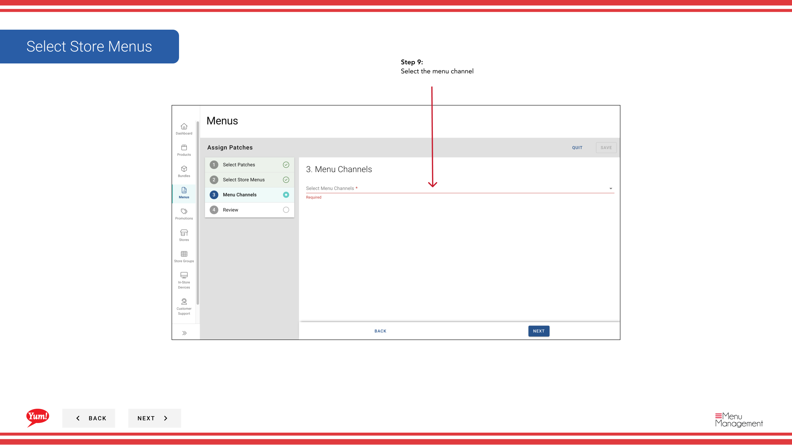
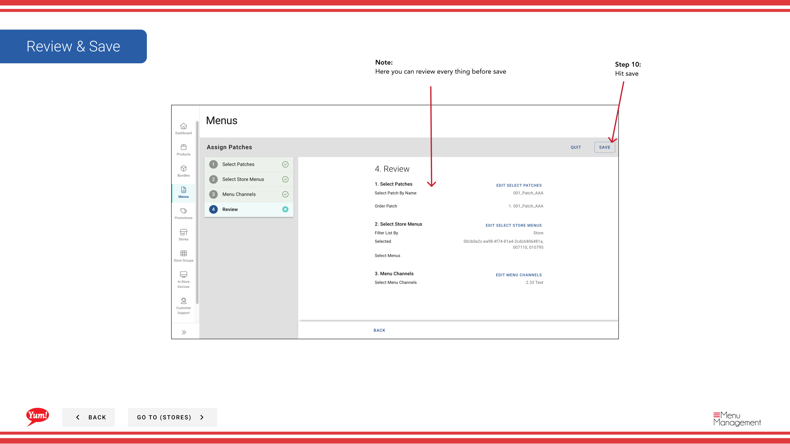

# Liste des lots de transfert

## Ce que ce guide couvre

Copie la configuration de la liste des patchs d'un magasin à un ou plusieurs autres magasins, en rationalisant la gestion des patchs à plusieurs endroits avec les mêmes redéfinitions.

## Étapes

**Step 1:** Naviguez dans la section **Stores** en utilisant le menu de navigation de gauche.

**Step 2:** Rechercher le magasin **source** (le magasin dont vous voulez copier les patchs) par **Nom**, **Numéro de magasin** ou **Code de franchise**.

**Step 3:** Une fois que vous trouvez le magasin, cliquez sur le menu ** à trois points** (••) pour ouvrir le menu des options.

**Step 4:** Cliquez sur **Menus** dans le menu déroulant.

**Step 5:** Localisez le canal avec les correctifs que vous voulez transférer, et cliquez sur le bouton **plus de menu** (-) sur cette ligne.

**Step 6:** Cliquez sur **Liste des lots de transfert** dans le menu des options.

**Step 7:** Sélectionnez les **patches** que vous souhaitez transférer en vérifiant leurs noms. Consultez la liste des correctifs à copier.

**Step 8:** Sélectionnez les magasins **destination** où vous voulez copier ces correctifs. Vous pouvez :
- Magasins de recherche par nom, numéro ou code
- Filtrer par **Store Group** en utilisant le menu déroulant pour sélectionner rapidement tous les magasins d'un groupe

**Step 9:** Sélectionnez le canal **menu** où les correctifs doivent être appliqués sur les magasins de destination (p. ex., Digital, Kiosque, In-Store).

**Step 10:** Examiner les détails du transfert pour vérifier que tout est correct avant de procéder.

**Step 11:** Cliquez sur **Save** (ou **Transfer**) pour copier les correctifs dans les magasins de destination sélectionnés.

:::tip
**Store Groups shortcut:** Utilisez le menu déroulant du filtre **Store Group** pour sélectionner rapidement tous les magasins d'une région ou d'un groupe de franchise, plutôt que de rechercher chaque magasin individuellement.
:::

:::note :
Transférer copie les patchs au fur et à mesure qu'ils sont commandés. Après le transfert, vérifiez que les correctifs fonctionnent correctement sur les magasins de destination avant de publier aux clients.
:::

## Guides connexes

- [Modifier la liste des correctifs](/docs/admin-portal-guide/stores/edit-patch-list/)— Gérer les patchs sur un seul magasin
- [Publier le menu](/docs/admin-portal-guide/stores/publish-menu/)— Publier le menu après le transfert des correctifs

---

* Une partie des[Guide du portail administratif](/docs/admin-portal-guide)· Section: Magasins*