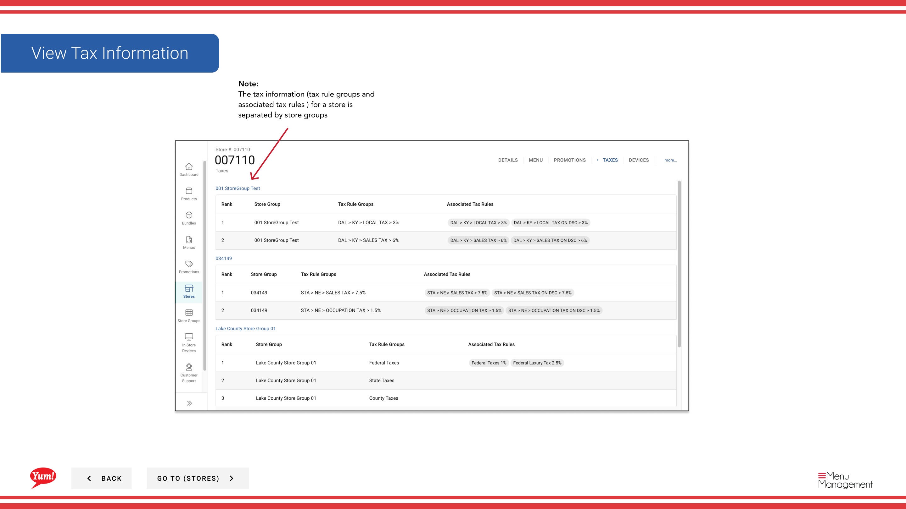

# Afficher les taxes

## Ce que ce guide couvre

Affiche tous les groupes de règles fiscales et les règles fiscales connexes appliquées à un magasin, séparés par groupe de magasins — utilisés pour vérifier la configuration fiscale aux fins de conformité.

## Étapes

**Step 1:** Naviguez dans la section **Stores** en utilisant le menu de navigation de gauche.

**Step 2:** Recherchez le magasin par **Nom**, **Numéro de magasin** ou **Code de franchise** à l'aide de la boîte de recherche.

**Step 3:** Une fois que vous trouvez le magasin, cliquez sur le menu ** à trois points** (••) pour ouvrir le menu des options.

**Step 4:** Cliquez sur **Taxes** dans le menu déroulant. Ceci affiche tous les groupes de règles fiscales et les règles configurées pour le magasin sélectionné.

**Step 5:** Consultez les règles fiscales affichées. Le tableau est organisé par **Store Group**, qui montre :
- **Nom du groupe* — Cette règle fiscale appartient au groupe commercial.
- ** Groupe des règles fiscales** — Le nom du groupe de règles fiscales
- **Règles fiscales** — Règles fiscales individuelles appliquées (p. ex. taux fédéraux, taux des États, taux locaux)
- **Taux d'imposition** — Pourcentage ou montant appliqué

:::note :
Les renseignements fiscaux sont séparés par groupe de magasins parce que différents groupes de magasins peuvent avoir des exigences fiscales différentes selon la région ou la juridiction. Si votre magasin appartient à plusieurs groupes de magasins, vous verrez des sections distinctes pour chacun.
:::

:::tip
Utilisez cette vue pour vérifier que les taux d'imposition corrects sont configurés pour l'emplacement de votre magasin avant de publier des menus pour les canaux de commande en direct.
:::

## Guides connexes

- [Modifier les détails du magasin](/docs/admin-portal-guide/stores/edit-store-details/)— Voir les autres informations du magasin
- [Afficher/désaffecter les groupes de magasins](/docs/admin-portal-guide/stores/viewunassign-a-stores-store-groups/)— Voir à quel groupe de magasins ce magasin appartient

---

* Une partie des[Guide du portail administratif](/docs/admin-portal-guide)· Section: Magasins*