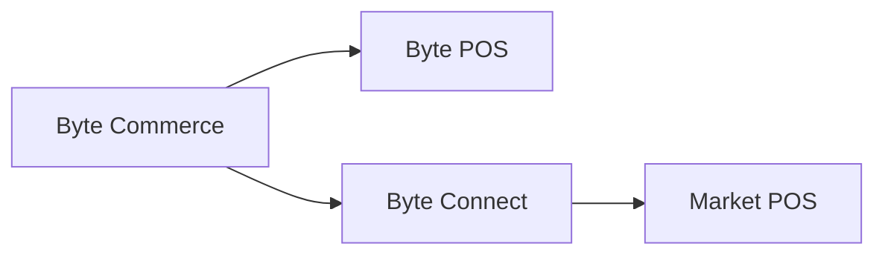

# Byte Connect

> Dans le contexte d'Atlas, Byte Connect est la couche d'intégration à l'intérieur de la plate-forme Byte qui devient importante chaque fois que Byte Commerce a besoin d'atteindre un environnement POS non-Byte ou un canal de vente externe.

---

## Atlas Contexte

Au sein d'Atlas Wiki, Byte Connect doit être compris comme faisant partie de l'image d'exploitation plus large **Atlas + Byte Commerce + Byte Portal**.

- **L'Atlas** est le front-end mondial de la KFC
- **Byte Commerce** gère la logique des transactions et l'orchestration de l'ordre
- **Byte Portal** est la principale surface administrative pour la configuration du marché et des ops
- **Byte Connect** est la couche d'intégration utilisée lorsque le routage du canal externe ou la connectivité POS non-Byte est impliqué

Cela signifie qu' Byte Connect n'est pas le produit orienté client et non l'interface utilisateur d'exploitation quotidienne, mais il fait toujours partie de la pile Byte chaque fois que les marchés dépendent d'intégrations de canaux tiers ou d'une configuration de POS non Byte.

---

## La règle de base

Si un marché est **non** en utilisant **Byte POS**, alors **Byte Connect doit être embarqué dans le cadre de Byte Commerce embarqué**.

Byte Commerce est branché pour parler directement à **Byte POS**. Pour les marchés de POS non-octets, Byte Connect se trouve au milieu et gère la voie d'intégration vers les POS du marché.

---

## Que fait Byte Connect

Byte Connect agit comme solution d'intégration au sein de la plateforme Byte, principalement gérée par l'API ** d'affaires**, qui aide les magasins et les marques à connecter Byte Commerce à :

- Environnements POS non-octets
- marchés de livraison tiers
- autres circuits de vente externes

En termes d'Atlas, cela signifie Byte Connect est la couche qui aide la plate-forme à atteindre au-delà de la norme **Byte Commerce -> Byte POS** chemin.

Cela signifie que le modèle mental opérationnel est:

- **Byte Commerce -> Byte POS** lorsque le marché utilise Byte POS
- **Byte Commerce -> Byte Connect -> POS** lorsque le marché n'utilise pas Byte POS

La chose la plus importante à éviter est de supposer que Byte Commerce peut directement parler à n'importe quel marché POS ou canal externe par défaut. Ça ne peut pas. Si Byte POS n'est pas présent, ou si le marché dépend des intégrations de canaux tiers supportées, Byte Connect devient partie intégrante du chemin.

---

## Capacités clés

Byte Connect peut prendre en charge :

- **Tiers canaux de vente** comme Uber Eats, DoorDash, Grubhub, Just Eat et Deliveroo
- **Contrôles des prix au niveau des canaux**, y compris la configuration de majoration spécifique au marché
- ** Choix d'acheminement de la livraison** pour chaque canal, comme la livraison effectuée sur le marché ou la livraison effectuée à l'interne
- **Règles d'instruction du conducteur** pour soutenir la bonne gestion de l'ordre en aval
- **Configuration des canaux de niveau standard** gérée par des opérations d'API d'affaires telles que`updateByteConnectStoreChannelConfig`

C'est la façon la plus utile de contextualiser Byte Connect dans Atlas : ce n'est pas seulement un connecteur générique. C'est une couche d'intégration soutenue par la configuration qui régit la façon dont les magasins d'un marché interagissent avec les canaux de livraison externes et, le cas échéant, la façon dont Byte Commerce atteint l'infrastructure de points de vente non-octets.

---

## Ce que cela signifie pour l'embarquement

Pour les marchés de POS non-octets, Byte Connect n'est pas un complément facultatif. Il fait partie du groupe Byte Commerce embarqué.

Les équipes qui planifient la configuration du marché, la portée du déploiement, les délais, les responsabilités d'intégration ou l'agrégation à bord devraient traiter Byte Connect comme une dépendance standard chaque fois que :

- le marché POS n'est pas Byte POS
- le marché dépend des canaux de livraison supportés par des tiers
- les règles de canal externe de stockage doivent être configurées ou régies centralement

En termes pratiques, Atlas signifie que la planification des lancements devrait traiter Byte Connect comme faisant partie de la préparation à l'intégration, et non comme une réflexion après la mise en place du front-end et du portail.

---

## Caveat opérationnel

De nombreuses capacités de Byte Connect sont actuellement décrites comme étant **BETA**, et certaines opérations peuvent ne pas être disponibles dans tous les environnements de production. L'accès à ces opérations nécessite généralement`byte_connect`rôle dans l'API d'affaires.

Cela importe pour Atlas car les équipes ne devraient pas supposer que chaque marché aura la même surface de Byte Connect en même temps.

---

## Quand faire référence à ceci

Utilisez cette page chaque fois que les équipes doivent expliquer:

- pourquoi Byte Commerce ne s'intègre pas directement à chaque POS
- pourquoi un marché de POS non-Byte a besoin de Byte Connect
- pourquoi agrégateur et configuration de canaux externes peuvent s'asseoir en dehors de la vue d'exploitation habituelle Portal-first
- comment Byte Commerce atteint le système de magasins sur un marché de points de vente non-octets
- comment les canaux de distribution tiers pris en charge sont configurés à la couche d'intégration plutôt que seulement dans le front-end

---

:::tip Autres
- [Limites des capacités](/docs/byte-capabilities/enablement/capability-boundaries)
- [Référence du moteur de commerce](/docs/byte-capabilities/reference/commerce-backend)
- [Modèle mental de la plateforme](/docs/byte-capabilities/mental-model)
:::
