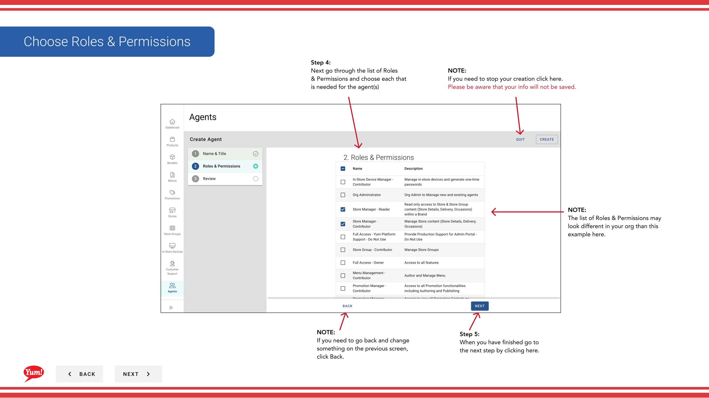

# エージェントを作成する

## このガイドで扱う内容

このガイドでは、Byte Commerce Admin Portal でエージェントを作成する手順を説明します。

## 手順

**ステップ 1:** まず、こちらをクリックして Agents 画面に移動します。
**ステップ 2:** a new agent click the “+ Create New Agent” ボタン。

**ステップ 2:** each “*”必須項目 を入力します。

**ステップ 3:** When you have finished go to
the next step by clicking here.

**ステップ 4:** Next go through the list of Roles
& Permissions and choose each that 
is needed for the agent(s)

**ステップ 5:** When you have finished go to
the next step by clicking here.

**ステップ 5:** Review the information you have entered for accuracy.

**ステップ 7:** When you are done, click Create.

## 注意事項

:::note
If you need to check if someone is already
an agent you can search for them in one of 
4 ways, by entering their info here.
:::

:::note
If need to create more agents click here and follow step 2.
:::

:::note
This field only excepts lowercase letters.
:::

:::note
If you need to stop your creation click here.
Please be aware that your info will not be saved.
:::

:::note
If you need to stop your creation click here.
Please be aware that your info will not be saved.
:::

:::note
The list of Roles & Permissions may
look different in your org than this 
example here.
:::

:::note
If you need to go back and change
something on the previous screen, 
click Back.
:::

:::note
If you need to stop your creation click here.
Please be aware that your info will not be saved.
:::

:::note
If you need to go back and change
something on the previous screen, 
click Back.
:::

:::note
If you need to Edit any information
click the appropriate link to go back
and edit that area.
:::

## 追加情報

- Menu Management User Guide
- Fill in the Agents’ info
- Choose Roles & Permissions
- Review entered information

---

*[管理ポータルガイド](/docs/admin-portal-guide) の一部 · セクション: エージェント*