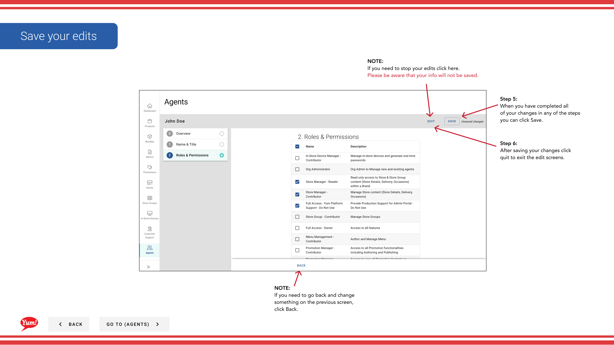

# エージェントを編集する

## このガイドで扱う内容

このガイドでは、Byte Commerce Admin Portal でエージェントを編集する手順を説明します。

## 手順

**ステップ 1:** まず、こちらをクリックして Agents 画面に移動します。
**ステップ 2:** To search for an agent in one of
4 ways, by entering their info here.

**ステップ 3:** Once you find the agent you are looking to Edit, こちらをクリック. then click Edit

**ステップ 4:** To edit any information you click
one of the two blue links or Next.

**ステップ 5:** When you have completed all
of your changes in any of the steps
you can click Save.

**ステップ 6:** After saving your changes click
quit to exit the edit screens.

## 注意事項

:::note
Agent roles and permissions
will be shown here for a quick view.
:::

:::note
You can not delete and agent but you can
remove all roles and permissions.
:::

:::note
If you would like to see up to 50
results at a time click here and choose
a count from the list.
:::

:::note
If you need to stop your edits click here.
Please be aware that your info will not be saved.
:::

:::note
If you need to stop your edits click here.
Please be aware that your info will not be saved.
:::

:::note
If you need to go back and change
something on the previous screen, 
click Back.
:::

## 追加情報

- Menu Management User Guide
- the エージェントs’ infoを編集する

---

*[管理ポータルガイド](/docs/admin-portal-guide) の一部 · セクション: エージェント*