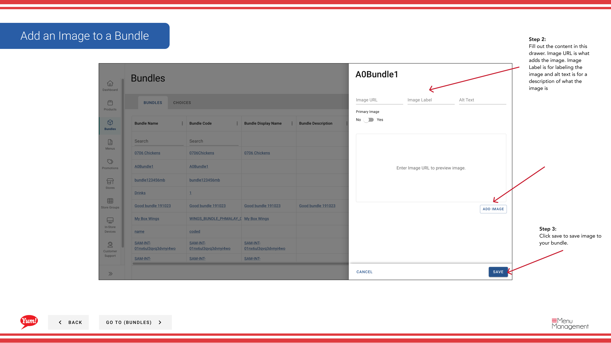

# バンドルに画像を追加する

## このガイドで扱う内容

このガイドでは、Byte Commerce Admin Portal でバンドルに画像を追加する手順を説明します。

## 手順

**ステップ 1:** まず、こちらをクリックして Bundles 画面に移動します。
**ステップ 2:** this  ボタン in the same row your bundle is in and then hit Images をクリックします。

**ステップ 2:** 入力します the content in this drawer. Image URL is what adds the image. Image Label is for labeling the image and alt text is for a description of what the image is

**ステップ 3:** save to save image to your bundle をクリックします。

## 追加情報

- バンドル - バンドルに画像を追加する
- バンドルに画像を追加する

---

*[管理ポータルガイド](/docs/admin-portal-guide) の一部 · セクション: バンドル*