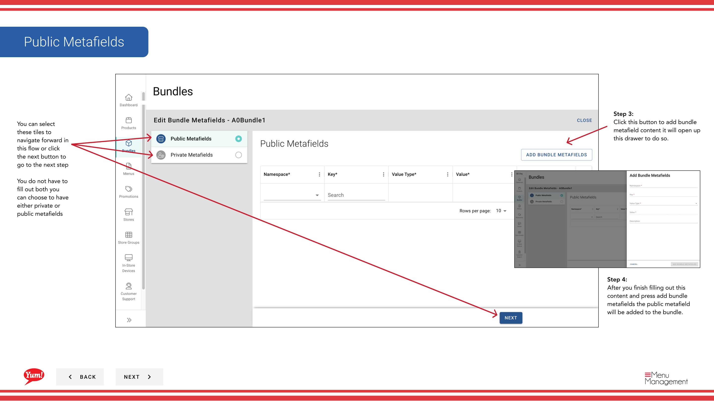

# バンドルにメタフィールドを追加する

## このガイドで扱う内容

このガイドでは、Byte Commerce Admin Portal でバンドルにメタフィールドを追加する手順を説明します。

## 手順

**ステップ 1:** まず、こちらをクリックして Bundles 画面に移動します。
**ステップ 2:** this  ボタン in the same row your bundle is in and then hit Meta をクリックします。

**ステップ 3:** this ボタン to add bundle metafield content it will open up this drawer to do so をクリックします。

**ステップ 4:** After you finish filling out this content and press add bundle metafields the public metafield will be added to the bundle.

**ステップ 5:** this ボタン to add bundle metafield content it will open up this drawer to do so をクリックします。

**ステップ 6:** After you finish filling out this content and press add bundle metafields the private metafield will be added to the bundle.

## 追加情報

- バンドル - バンドルにメタフィールドを追加する
- You can select these tiles to navigate forward in this flow or click the next button to go to the next step  You do not have to fill out both you can choose to have either private or public metafields

---

*[管理ポータルガイド](/docs/admin-portal-guide) の一部 · セクション: バンドル*