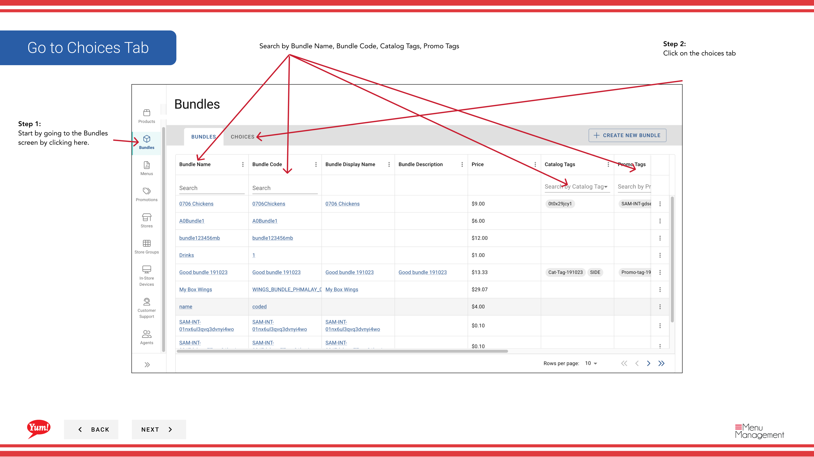

# 選択肢をコピーする

## このガイドで扱う内容

このガイドでは、Byte Commerce Admin Portal で選択肢をコピーする手順を説明します。

## 手順

**ステップ 1:** まず、こちらをクリックして Bundles 画面に移動します。
**ステップ 2:** on the choices tab をクリックします。

**ステップ 3:** this  ボタン in the same row the choice you want to copy is in and then click copy をクリックします。

**ステップ 4:** Create a new choice code. By default since the choice name will be copy of “choice name” changed if needed. Also by default of the choice data is copied

**ステップ 5:** Hit create choice.

## 追加情報

- バンドル - 選択肢をコピーする
- Search by Bundle Name, Bundle Code, Catalog Tags, Promo Tags
- (Copy) Create a Choice
- Optional: Add more variants if needed

---

*[管理ポータルガイド](/docs/admin-portal-guide) の一部 · セクション: バンドル*