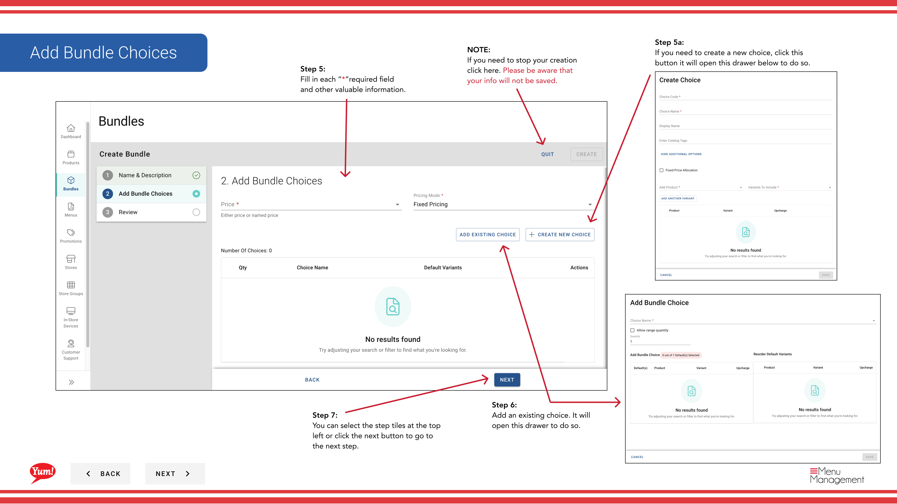

# バンドルを作成する

## このガイドで扱う内容

このガイドでは、Byte Commerce Admin Portal でバンドルを作成する手順を説明します。

## 手順

**ステップ 1:** まず、こちらをクリックして Bundles 画面に移動します。

**ステップ 2:** In order to create a bundle you need to click on this create new
**ステップ 3:** each “*”必須項目 and other valuable information を入力します。

**ステップ 4:** You can select the step tiles at the top left or click the next ボタン to go to the next step

**Step 5a:** If you need to create a new choice, click this button it will open this drawer below to do so.

**ステップ 5:** each “*”必須項目 and other valuable information を入力します。

**ステップ 6:** Add an existing choice. It will open this drawer to do so.

**ステップ 7:** You can select the step tiles at the top left or click the next ボタン to go to the next step.

**ステップ 8:** Take on last look at all the entered details making sure they are right. Depending on your 画面 sizes you may need to scroll down to see all of the products details.

**ステップ 9:** 完了したら、reviewing click Create。

## 注意事項

:::note
Click to add extra information such as nutrition information, Bundle Identifier, Catalog Tags, and Promo Tags.
:::

:::note
To add item availability details to the bundle, click here and a drawer will pull.
:::

:::note
作業を中止する場合はここをクリックしてください。入力内容は保存されません。
:::

:::note
If you need to go back to the specific step click on the Blue titles like this one.
:::

:::note
Need to go back to the previous screen, click Back.
:::

## 追加情報

- バンドル - バンドルを作成する

---

*[管理ポータルガイド](/docs/admin-portal-guide) の一部 · セクション: バンドル*