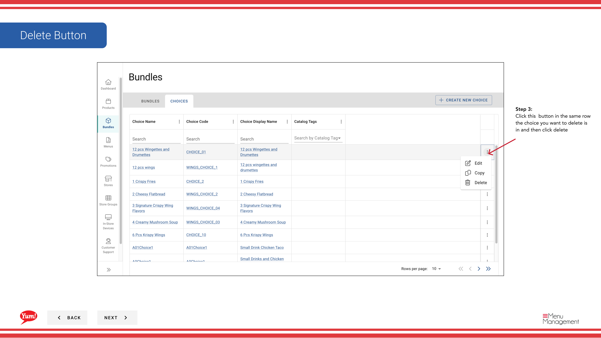

# 選択肢を削除する

## このガイドで扱う内容

このガイドでは、Byte Commerce Admin Portal で選択肢を削除する手順を説明します。

## 手順

**ステップ 1:** まず、こちらをクリックして Bundles 画面に移動します。
**ステップ 2:** on the choices tab をクリックします。

**ステップ 3:** this  ボタン in the same row the choice you want to delete is in and then click delete をクリックします。

**ステップ 4:** to delete をクリックします。

## 注意事項

:::note
Keep in my mind that deleting this choice will remove all choice values and corresponding variants and pricing from related products.
:::

:::note
Cancel at anytime if necessary
:::

## 追加情報

- バンドル - 選択肢を削除する
- Search by Bundle Name, Bundle Code, Catalog Tags, Promo Tags

---

*[管理ポータルガイド](/docs/admin-portal-guide) の一部 · セクション: バンドル*