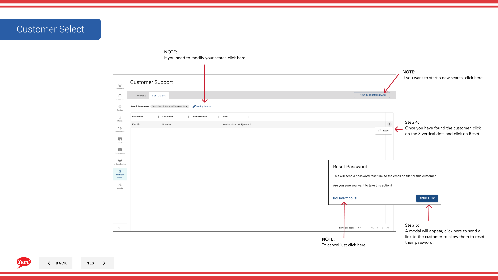

# 顧客検索

## このガイドで扱う内容

このガイドでは、Byte Commerce Admin Portal で顧客検索手順を説明します。

## 手順

**ステップ 1:** まず、こちらをクリックして Customer Support 画面に移動します。
**ステップ 2:** as many fields in the box as you can to help narrow down your search for better results finding the customer you are looking for を入力します。

**ステップ 3:** Once you have entered in all of the needed information, Click Search to reveal your findings. It will become active as you enter in information.

**ステップ 4:** Once you have found the customer, click on the 3 vertical dots and click on Reset.

**ステップ 5:** A modal will appear, こちらをクリック to send a link to the customer to allow them to reset their password.

## 注意事項

:::note
If you need to start over click Reset Form.
:::

:::note
If you need to modify your search click here
:::

:::note
To cancel just click here.
:::

:::note
If you want to start a new search, click here.
:::

## 追加情報

- Customer Support: Customer Search
- 顧客検索 - No Results

---

*[管理ポータルガイド](/docs/admin-portal-guide) の一部 · セクション: カスタマーサポート*