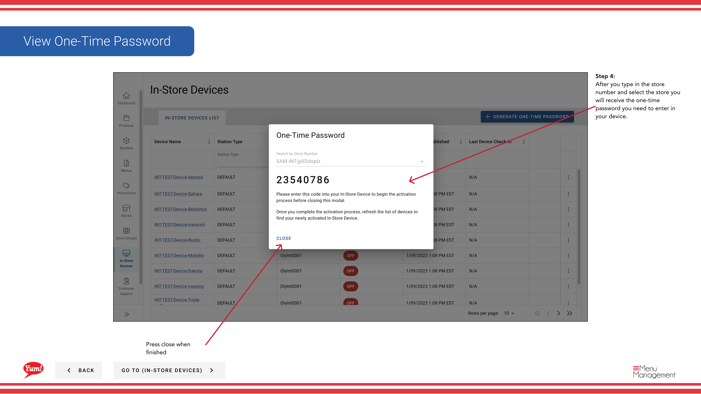

# ワンタイムパスワードを生成する

## このガイドで扱う内容

このガイドでは、Byte Commerce Admin Portal でワンタイムパスワードを生成する手順を説明します。

## 手順

**ステップ 1:** まず、こちらをクリックして In-Store Devices 画面に移動します。
**ステップ 2:** this ボタン to Generate a One Time Password をクリックします。

**ステップ 3:** Type in the store that you want to generate a one-time password for.

**ステップ 4:** After you type in the store number and select the store you will receive the one-time password you need to enter in your device.

## 追加情報

- Menu Management User Guide
- 店内デバイス - ワンタイムパスワードを生成する
- Search/Filter by Station Type, Store Number, and Device Status
- One-Time Passwordを確認する

---

*[管理ポータルガイド](/docs/admin-portal-guide) の一部 · セクション: 店内デバイス*