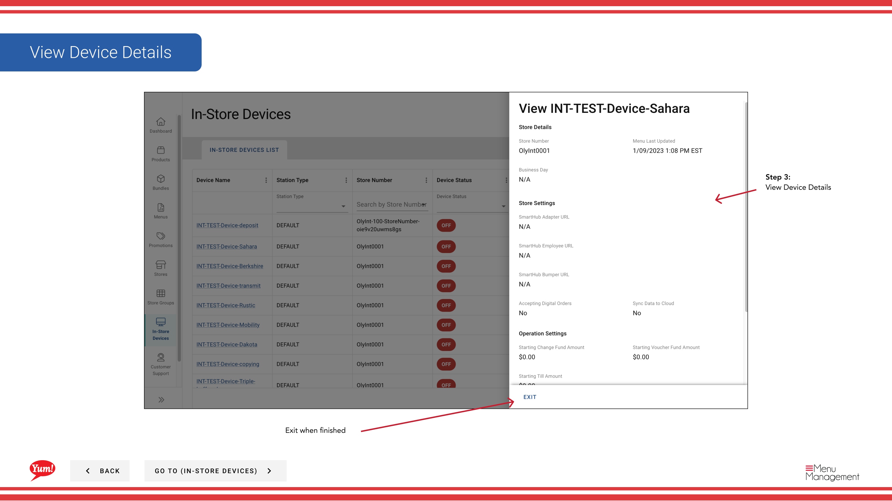

# 店内デバイス詳細を確認する

## このガイドで扱う内容

このガイドでは、Byte Commerce Admin Portal で店内デバイス詳細を確認する手順を説明します。

## 手順

**ステップ 1:** まず、こちらをクリックして In-Store Devices 画面に移動します。
**ステップ 2:** this ボタン in the same row the device you want to configure is in and then hit View をクリックします。

**ステップ 3:** View Device Details

## 追加情報

- Menu Management User Guide
- 店内デバイス - 店内デバイス詳細を確認する
- Search/Filter by Station Type, Store Number, and Device Status
- GO TO (IN-STORE DEVICES)

---

*[管理ポータルガイド](/docs/admin-portal-guide) の一部 · セクション: 店内デバイス*