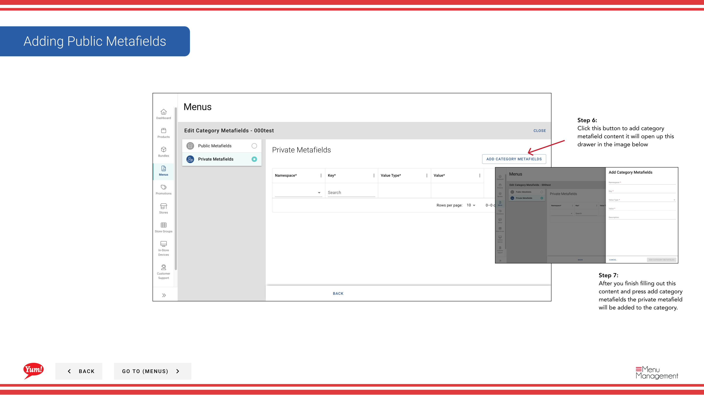

# カテゴリにメタフィールドを追加する

## このガイドで扱う内容

このガイドでは、Byte Commerce Admin Portal でカテゴリにメタフィールドを追加する手順を説明します。

## 手順

**ステップ 1:** まず、こちらをクリックして Menu 画面に移動します。
**ステップ 2:** on the categories folder をクリックします。

**ステップ 3:** this  ボタン in the same row the category you’re looking for is in and then hit Meta をクリックします。

**ステップ 4:** this ボタン to add category metafield content it will open up this drawer in the image below をクリックします。

**ステップ 5:** After you finish filling out this content and press add category metafields the public metafield will be added to the category.

**ステップ 6:** this ボタン to add category metafield content it will open up this drawer in the image below をクリックします。

**ステップ 7:** After you finish filling out this content and press add category metafields the private metafield will be added to the category.

## 追加情報

- メニュー - Add Category Metafields
- Adding Public Metafields

---

*[管理ポータルガイド](/docs/admin-portal-guide) の一部 · セクション: メニュー*