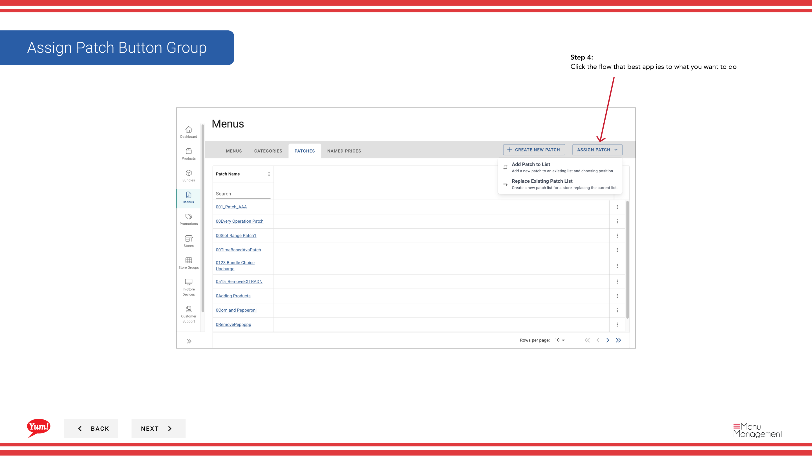

# パッチを割り当てる（Replace Existing List）

## このガイドで扱う内容

店舗の patch list 全体を新しい単一パッチで置き換え、以前に割り当てられていたパッチをすべて外す手順です。店舗やチャネルのパッチを完全にリセットしたい場合に使います。

## 手順

**ステップ 1:** 左側のナビゲーションから **Menus** セクションに移動します。

**ステップ 2:** **Patches** タブをクリックして、利用可能なパッチ一覧を表示します。

**ステップ 3:** **Create New** をクリックして、新しいパッチ割り当てを開始します。

**ステップ 4:** **Replace Existing List** を選択して、店舗の patch list 全体を置き換えます。

**ステップ 5:** ドロップダウンから割り当てたい **Patch** を選択します。このパッチが現在割り当てられているすべてのパッチを置き換えます。

**ステップ 6:** 新しい patch list を適用する **Stores** を選択します。店舗名検索やストアグループでの絞り込みも使えます。

**ステップ 7:** この置き換えを適用する **Channel** を選択します。

**ステップ 8:** **Summary** で店舗とパッチ内容を確認し、**Save** をクリックして patch list を置き換えます。

## 注意事項

:::note
店舗はドロップダウンから特定のストアグループを選んで絞り込むこともできます。
:::

:::note
保存前に、店舗とパッチ内容をここで最終確認できます。
:::

## 関連ガイド

- [パッチを割り当てる（Add to Patch List）](/docs/admin-portal-guide/menus/assign-a-patch-add-to-patch-list/) - 既存のパッチを残したまま追加します
- [パッチを編集する](/docs/admin-portal-guide/menus/edit-a-patch/) - 割り当て前にパッチ内容を更新します
- [パッチを作成する](/docs/admin-portal-guide/menus/create-a-patch/) - 新しいパッチを作成します

---

*[Admin Portal ガイド](/docs/admin-portal-guide) の一部 · セクション: メニュー*
