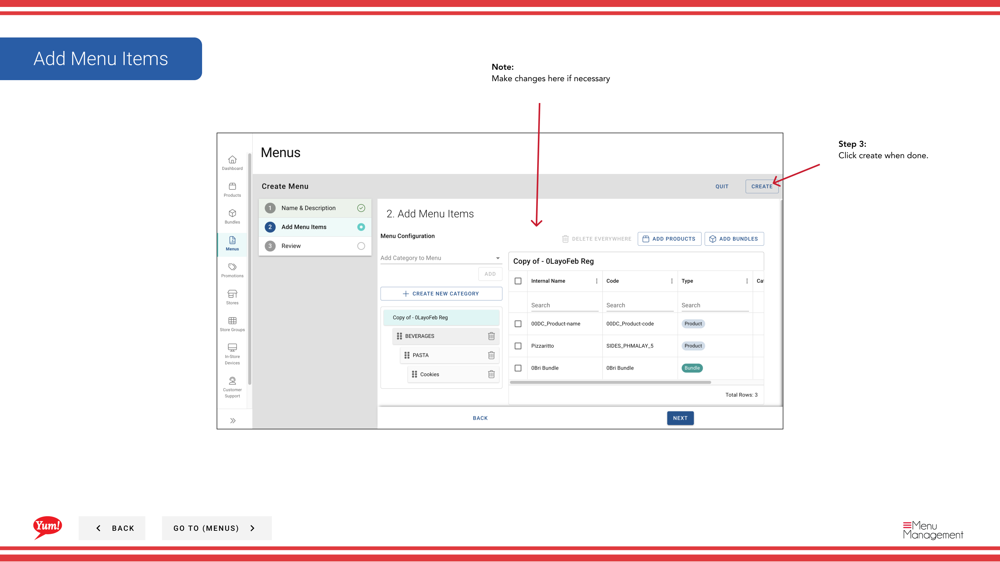

# メニューをコピーする

## このガイドで扱う内容

このガイドでは、Byte Commerce Admin Portal でメニューをコピーする手順を説明します。

## 手順

**ステップ 1:** まず、こちらをクリックして Menu 画面に移動します。
**ステップ 2:** this ボタン in the same row the menu you’re looking for is in and then hit Copy をクリックします。

**ステップ 3:** Create a menu code and edit menu name if needed.

**ステップ 3:** create when done をクリックします。

## 注意事項

:::note
Make changes here if necessary
:::

---

*[管理ポータルガイド](/docs/admin-portal-guide) の一部 · セクション: メニュー*