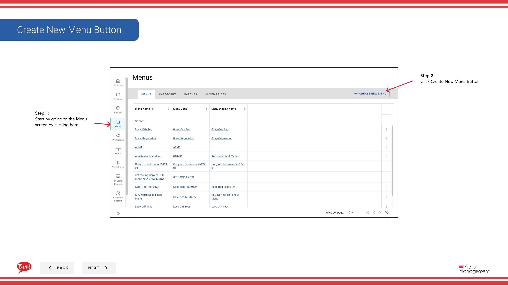

# メニューを作成する

## このガイドで扱う内容

このガイドでは、Byte Commerce Admin Portal でメニューを作成する手順を説明します。

## 手順

**ステップ 1:** まず、こちらをクリックして Menu 画面に移動します。
**ステップ 2:** Create New Menu Button をクリックします。

**ステップ 3:** Create menu code and menu name.

**ステップ 4:** add a category dropdown to add a categoryためにここを使用します。

**ステップ 5:** After selecting categories press add to officially add them to your menu

**ステップ 6:** add a category dropdown to add a category. Drawers will pop that allow you to search for products/bundles to add once you select them hit add to menuためにここを使用します。

**ステップ 7:** Hit create when finished.

## 注意事項

:::note
ここから新しいカテゴリを作成できます。
:::

:::note
ここにメニュー名が表示されます。
:::

:::note
カテゴリを追加した後、商品やバンドルを追加する際は対象カテゴリを選択してください。
:::

:::note
カテゴリを別のカテゴリの中へドラッグすると、サブカテゴリを作成できます。
:::

## 追加情報

- メニュー - メニューを作成する
- Create New Menu Button

---

*[管理ポータルガイド](/docs/admin-portal-guide) の一部 · セクション: メニュー*