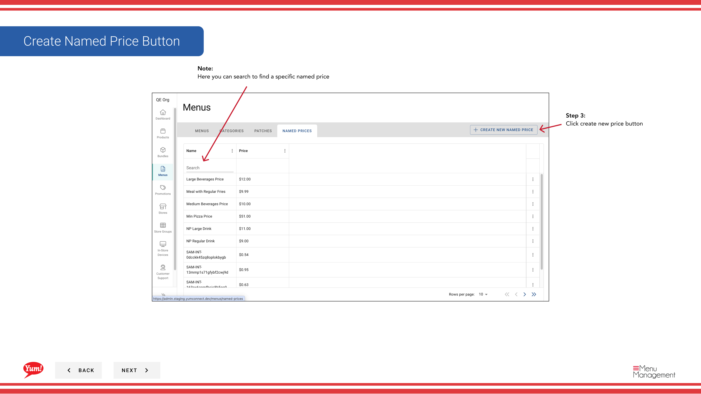
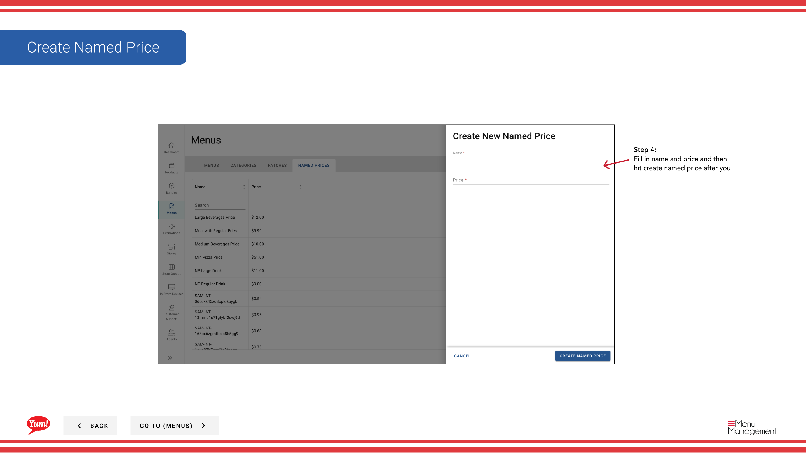

# 指名価格を作成する

## このガイドで扱う内容

このガイドでは、Byte Commerce Admin Portal で指名価格を作成する手順を説明します。

## 手順

**ステップ 1:** Start by going to Menus 画面 by clicking here.
**ステップ 2:** named price をクリックします。

**ステップ 3:** create new price ボタン をクリックします。

**ステップ 4:** name and price and then hit create named price after you を入力します。

## 注意事項

:::note
If you would like to see up to 50 results at a time click here and choose a count from the list.
:::

:::note
Here you can search to find a specific named price
:::

## 追加情報

- メニュー - 指名価格を作成する
- Create Named Price Button

---

*[管理ポータルガイド](/docs/admin-portal-guide) の一部 · セクション: メニュー*