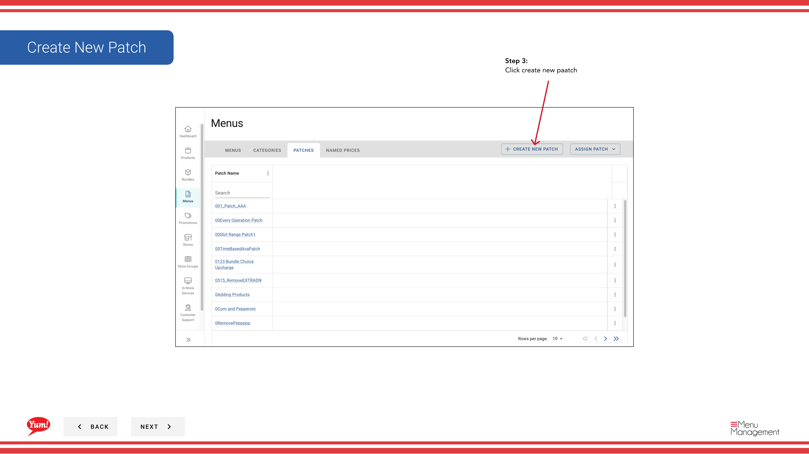

# パッチを作成する

## このガイドで扱う内容

このガイドでは、Byte Commerce Admin Portal でパッチを作成する手順を説明します。

## 手順

**ステップ 1:** まず、こちらをクリックして Menu 画面に移動します。
**ステップ 2:** on the patches tab をクリックします。

**ステップ 3:** create new paatch をクリックします。

**ステップ 4:** Create a name for the patch

**ステップ 5:** a operation for the patch を選択します。

**ステップ 6:** add operation after selecting a patch operation をクリックします。

**ステップ 7:** the items you need to add related to your patch operation, after you select a operation press add operation を選択します。

**ステップ 8:** create to create the patch をクリックします。

## 注意事項

:::note
Here you can see your patch added to the table.
:::

:::note
You can edit, reorder, copy, and delete patches you’ve added to this list.
:::

:::note
You can continue to add more patches by clicking the “select operation dropdown”
:::

## 追加情報

- メニュー - パッチを作成する

---

*[管理ポータルガイド](/docs/admin-portal-guide) の一部 · セクション: メニュー*