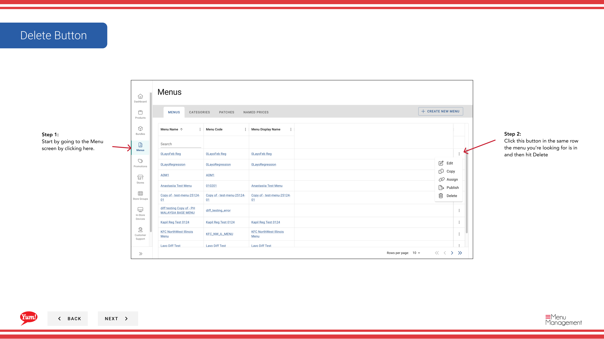
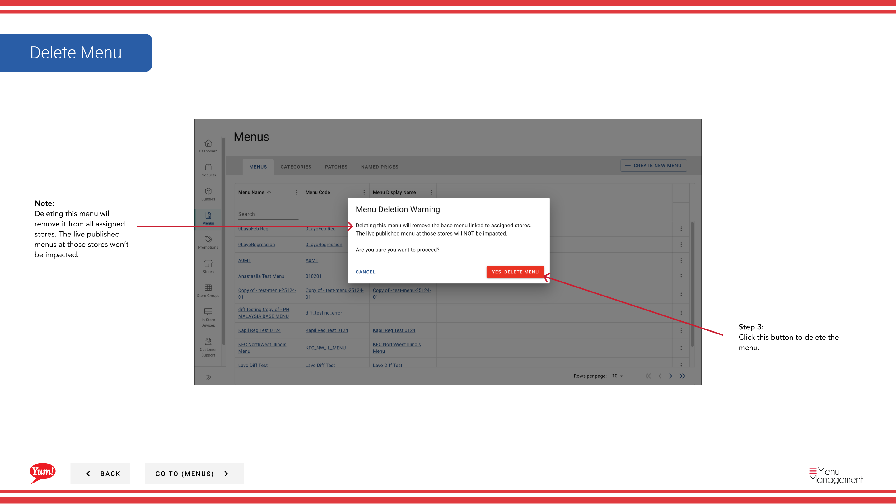

# メニューを削除する

## このガイドで扱う内容

このガイドでは、Byte Commerce Admin Portal でメニューを削除する手順を説明します。

## 手順

**ステップ 1:** まず、こちらをクリックして Menu 画面に移動します。
**ステップ 2:** this ボタン in the same row the menu you’re looking for is in and then hit Delete をクリックします。

**ステップ 3:** this ボタン to delete the menu をクリックします。

## 注意事項

:::note
Deleting this menu will remove it from all assigned stores. The live published menus at those stores won’t be impacted.
:::

## 追加情報

- メニュー - メニューを削除する

---

*[管理ポータルガイド](/docs/admin-portal-guide) の一部 · セクション: メニュー*