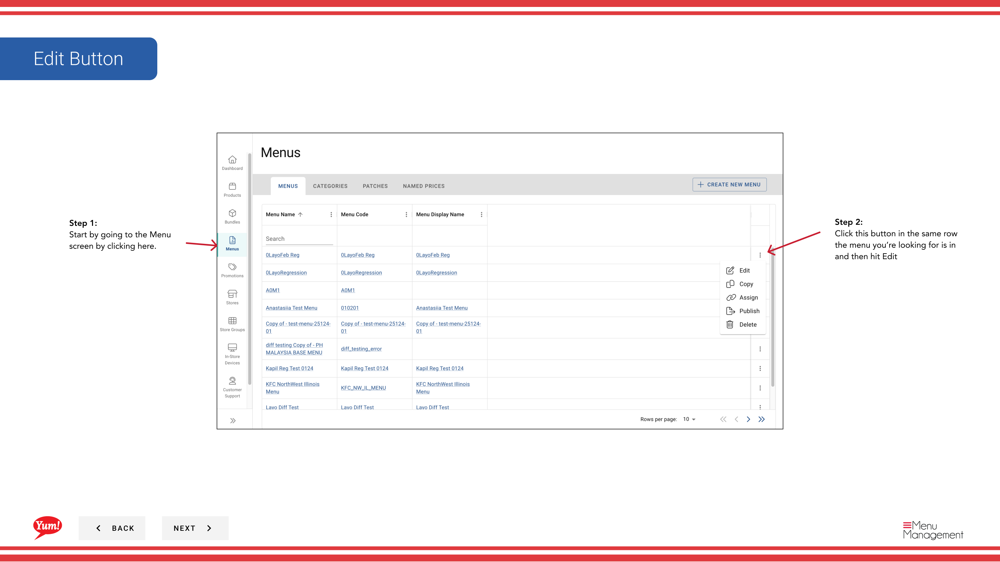
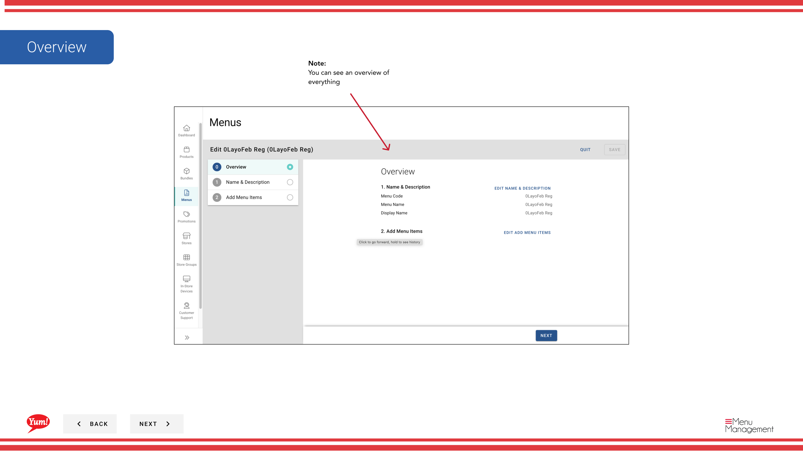

# メニューを編集する

## このガイドで扱う内容

このガイドでは、Byte Commerce Admin Portal でメニューを編集する手順を説明します。

## 手順

**ステップ 1:** まず、こちらをクリックして Menu 画面に移動します。
**ステップ 2:** this ボタン in the same row the menu you’re looking for is in and then hit Edit をクリックします。

**ステップ 3:** After making edits hit save

## 注意事項

:::note
You can see an overview of everything
:::

:::note
You can edit name or code or display name if necessary
:::

:::note
You can make changes here
:::

---

*[管理ポータルガイド](/docs/admin-portal-guide) の一部 · セクション: メニュー*