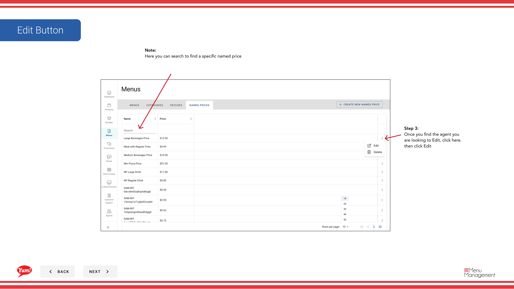

# 指名価格を編集する

## このガイドで扱う内容

このガイドでは、Byte Commerce Admin Portal で指名価格を編集する手順を説明します。

## 手順

**ステップ 1:** Start by going to Menus 画面 by clicking here.
**ステップ 1:** まず、こちらをクリックして Agents 画面に移動します。

**ステップ 2:** named price をクリックします。

**ステップ 3:** Once you find the agent you are looking to Edit, こちらをクリック. then click Edit

**ステップ 4:** Here you can edit the changed price and after you are done click save.

## 注意事項

:::note
If you would like to see up to 50 results at a time click here and choose a count from the list.
:::

:::note
Here you can search to find a specific named price
:::

## 追加情報

- メニュー - 指名価格を編集する

---

*[管理ポータルガイド](/docs/admin-portal-guide) の一部 · セクション: メニュー*