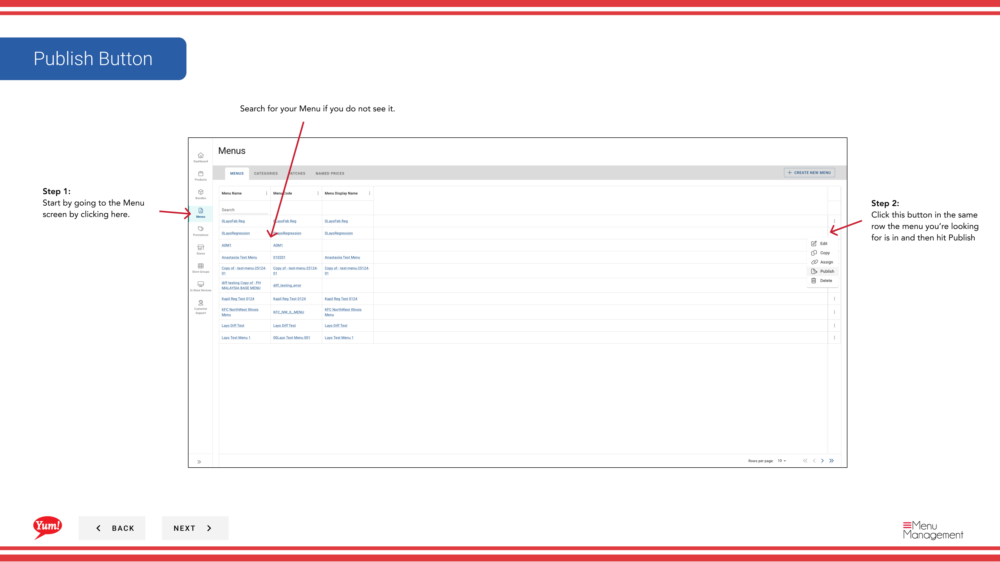
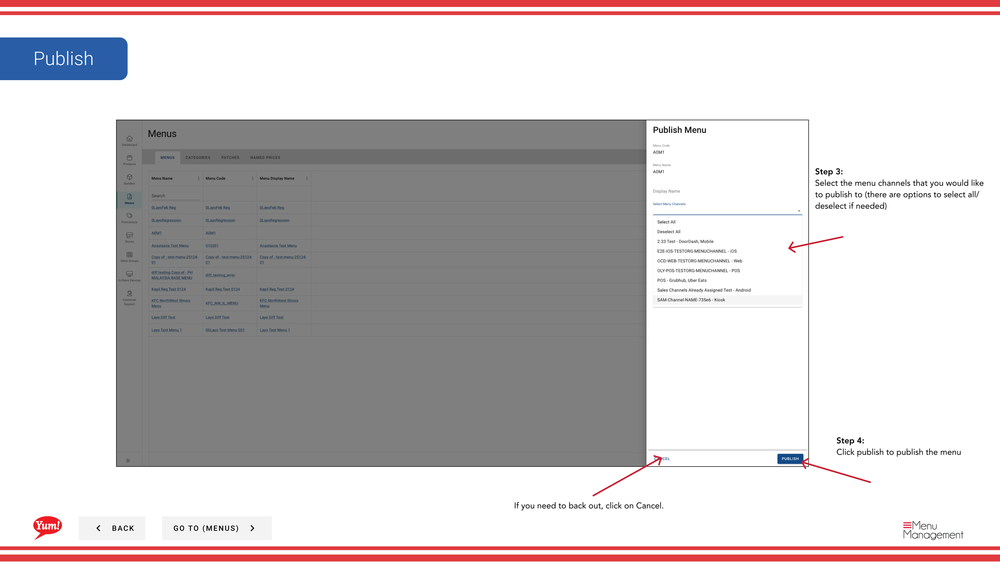

# メニューを公開する

## このガイドで扱う内容

このガイドでは、Byte Commerce Admin Portal でメニューを公開する手順を説明します。

## 手順

**ステップ 1:** まず、こちらをクリックして Menu 画面に移動します。
**ステップ 2:** this ボタン in the same row the menu you’re looking for is in and then hit Publish をクリックします。

**ステップ 3:** the menu channels that you would like to publish to (there are options to select all/deselect if needed) を選択します。

**ステップ 4:** publish to publish the menu をクリックします。

## 追加情報

- メニュー - メニュー (Look at 店舗sを公開する - メニュー for Alternative Path)を公開する
- Search for your Menu if you do not see it.
- If you need to back out, click on Cancel.

---

*[管理ポータルガイド](/docs/admin-portal-guide) の一部 · セクション: メニュー*