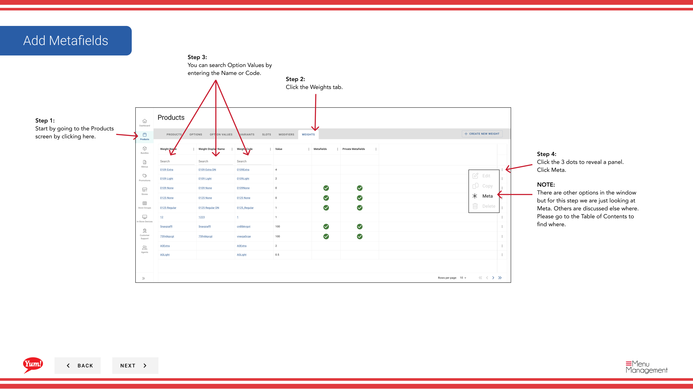
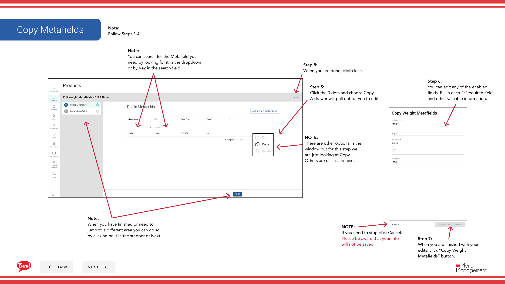
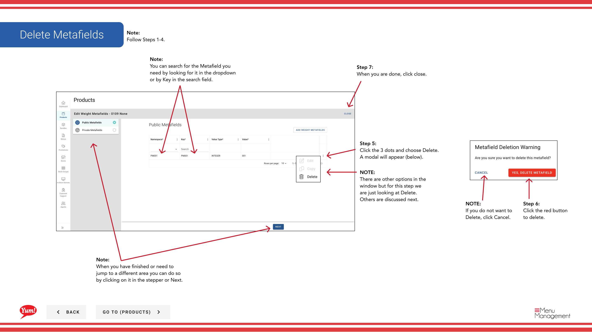

# 重みにメタフィールドを追加する

## このガイドで扱う内容

このガイドでは、Byte Commerce Admin Portal で重みにメタフィールドを追加する手順を説明します。

## 手順

**ステップ 1:** まず、こちらをクリックして Products 画面に移動します。

**ステップ 2:** the Weights tab をクリックします。
**ステップ 3:** You can search Option Values by entering the Name or Code.

**ステップ 4:** the 3 dots to reveal a panel. Click Meta をクリックします。

**ステップ 5:** here to open the drawer to fill in をクリックします。

**ステップ 5:** the 3 dots and choose Edit. A drawer will pull out for you to edit をクリックします。

**ステップ 5:** the 3 dots and choose Copy. A drawer will pull out for you to edit をクリックします。

**ステップ 5:** the 3 dots and choose Delete. A modal will appear (below) をクリックします。

**ステップ 6:** each “*”必須項目 and other valuable information を入力します。

**ステップ 6:** You can edit any of the enabled fields. Fill in each “*”必須項目 and other valuable information.

**ステップ 6:** the red ボタン to delete をクリックします。

**ステップ 7:** When you start filling in the info this ボタン will turn blue, click it when you are done.

**ステップ 7:** 完了したら、with your edits, click Save。

**ステップ 7:** 完了したら、with your edits, click “Copy Weight Metafields” ボタン。

**ステップ 7:** When you are done, click close.

**ステップ 8:** When you are done, click close.

## 注意事項

:::note
If you need to stop click Cancel. Please be aware that your info will not be saved.
:::

:::note
Adding Metafields to Public or Private is exactly the same.
:::

:::note
When you have finished or need to jump to a different area you can do so by clicking on it in the stepper or Next.
:::

:::note
Follow Steps 1-4.
:::

:::note
You can search for the Metafield you need by looking for it in the dropdown or by Key in the search field.
:::

:::note
There are other options in the window but for this step we are just looking at Edit. Others are discussed next.
:::

:::note
There are other options in the window but for this step we are just looking at Copy. Others are discussed next.
:::

:::note
There are other options in the window but for this step we are just looking at Delete. Others are discussed next.
:::

:::note
If you do not want to Delete, click Cancel.
:::

:::note
There are other options in the window  but for this step we are just looking at Meta. Others are discussed else where. Please go to the Table of Contents to find where.
:::

## 追加情報

- Add/Edit/Copy/Delete Meta Data on a Weight

---

*[管理ポータルガイド](/docs/admin-portal-guide) の一部 · セクション: 商品*