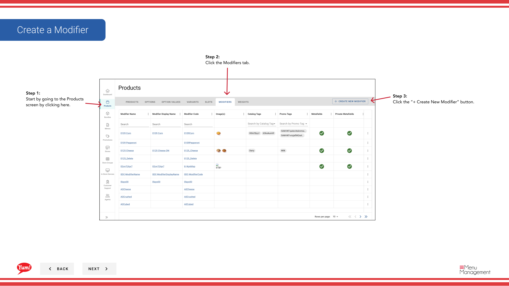

# モディファイアを作成する

## このガイドで扱う内容

このガイドでは、Byte Commerce Admin Portal でモディファイアを作成する手順を説明します。

## 手順

**ステップ 1:** まず、こちらをクリックして Products 画面に移動します。
**ステップ 2:** the Modifiers tab をクリックします。

**ステップ 3:** the “+ Create New Modifier” ボタン をクリックします。

**ステップ 4:** each “*”必須項目 and other valuable information を入力します。

**ステップ 5:** 完了したら、adding in all the information, click the Create Modifier ボタン。

## 注意事項

:::note
作業を中止する場合はここをクリックしてください。入力内容は保存されません。
:::

:::note
If you need this image to be the Primary image shown, click to toggle to Yes.
:::

:::note
Depending on your screen size you may need to scroll to see all of the fields.
:::

:::note
If you need to add another image, click here and fill in all needed information.
:::

## 追加情報

- オプション値を作成する

---

*[管理ポータルガイド](/docs/admin-portal-guide) の一部 · セクション: 商品*