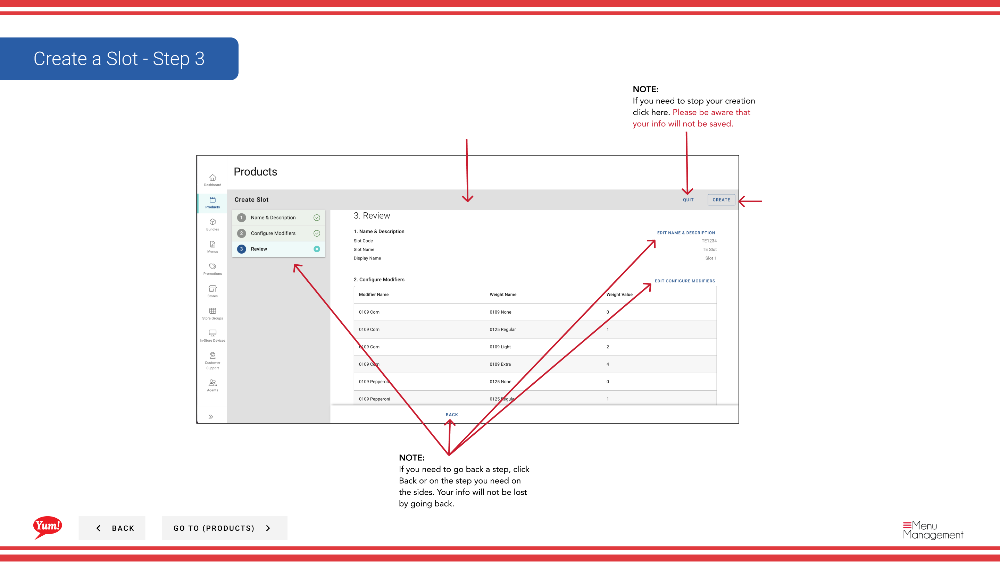

# スロットを作成する

## このガイドで扱う内容

このガイドでは、Byte Commerce Admin Portal でスロットを作成する手順を説明します。

## 手順

**ステップ 1:** まず、こちらをクリックして Products 画面に移動します。
**ステップ 2:** the Slots tab をクリックします。

**ステップ 3:** the “+ Create New Slot” ボタン をクリックします。

**ステップ 4:** each “*”必須項目 and other valuable information を入力します。

**ステップ 5:** 完了したら、adding in all the information, click Next to continue。

**ステップ 6:** Choose all Modifiers needed from the drop down and then click the Add ボタン.

**ステップ 7:** Choose all the Weights needed from the drop down and then click the Add ボタン.

## 注意事項

:::note
作業を中止する場合はここをクリックしてください。入力内容は保存されません。
:::

:::note
If you do not see a Modifier you need click the Create New Modifier and follow the steps. Creating a Modifier will not be discussed in this flow.
:::

:::note
If you need to go back a step, click Back. Your info will not be lost by going back.
:::

:::note
After adding Modifiers a notification will let you know that you need to add Weights to the modifier.
:::

:::note
If your Modifiers will be using the same Weights, then check this box for a bulk action.
:::

:::note
If needed drag and drop them in the order you need them to be by clicking on the 6 Vertical dots.
:::

:::note
If you need to go back a step, click Back or on the step you need on the sides. Your info will not be lost by going back.
:::

## 追加情報

- スロットを作成する - Step 1
- スロットを作成する - Step 2
- スロットを作成する - Step 2, cont’d
- スロットを作成する - Step 3

---

*[管理ポータルガイド](/docs/admin-portal-guide) の一部 · セクション: 商品*