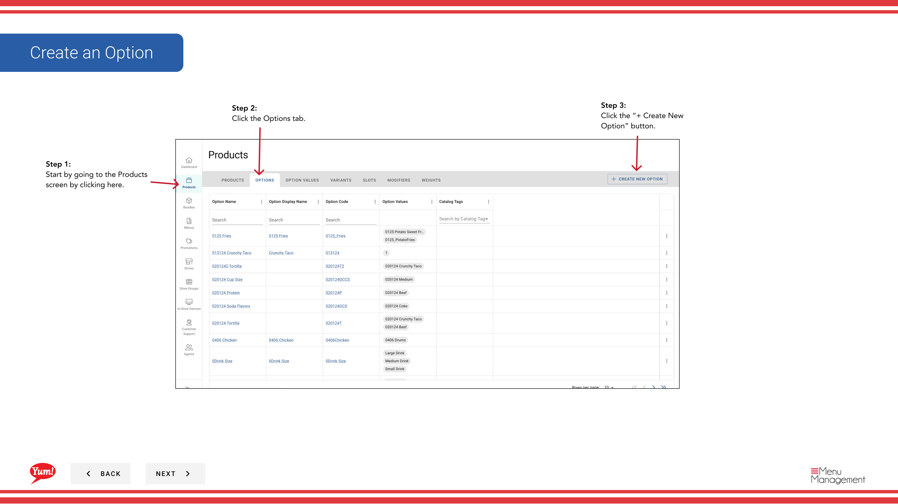
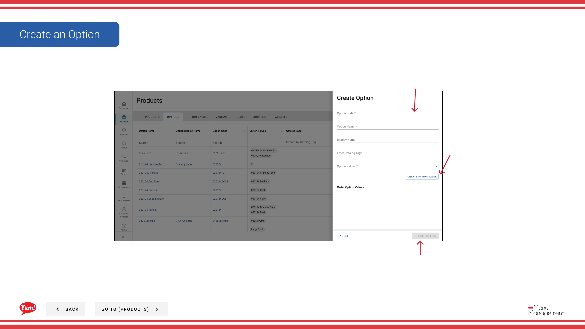

# オプションを作成する

## このガイドで扱う内容

このガイドでは、Byte Commerce Admin Portal でオプションを作成する手順を説明します。

## 手順

**ステップ 1:** まず、こちらをクリックして Products 画面に移動します。
**ステップ 2:** the Options tab をクリックします。

**ステップ 3:** the “+ Create New Option” ボタン をクリックします。

---

*[管理ポータルガイド](/docs/admin-portal-guide) の一部 · セクション: 商品*