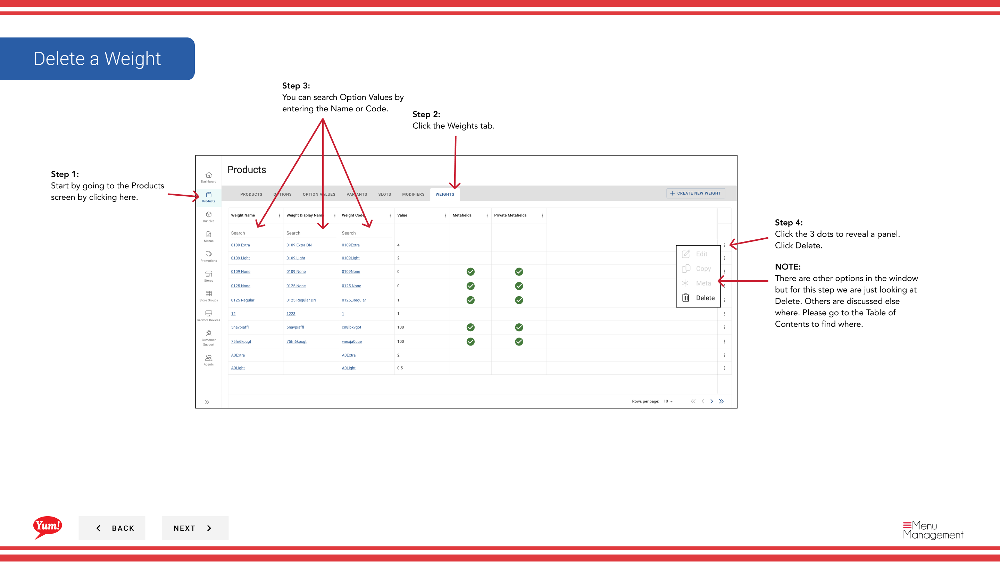

# 重みを削除する

## このガイドで扱う内容

このガイドでは、Byte Commerce Admin Portal で重みを削除する手順を説明します。

## 手順

**ステップ 1:** まず、こちらをクリックして Products 画面に移動します。
**ステップ 2:** the Weights tab をクリックします。

**ステップ 3:** You can search Option Values by entering the Name or Code.

**ステップ 4:** the 3 dots to reveal a panel. Click Delete をクリックします。

**ステップ 5:** the Red ボタン to permanently delete the Slot をクリックします。

## 注意事項

:::note
There are other options in the window  but for this step we are just looking at Delete. Others are discussed else where. Please go to the Table of Contents to find where.
:::

:::note
If you do not want to delete the Slot click Cancel.
:::

## 追加情報

- WARNING: This modal will show you all the different areas of the Catalog that the product will be removed from. We suggest you look this over before deleting. Deleting isn’t reversible.

---

*[管理ポータルガイド](/docs/admin-portal-guide) の一部 · セクション: 商品*