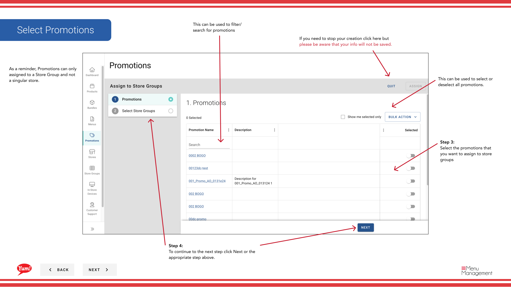

# プロモーションをストアグループに割り当てる

## このガイドで扱う内容

このガイドでは、Byte Commerce Admin Portal でプロモーションをストアグループに割り当てる手順を説明します。

## 手順

**ステップ 1:** まず、こちらをクリックして Promotions 画面に移動します。
**ステップ 2:** this ボタン to assign a promotion to store groups をクリックします。

**ステップ 3:** the promotions that you want to assign to store groups を選択します。

**ステップ 4:** To continue to the next step click Next or the appropriate step above.

**ステップ 5:** the store groups that you want to have promotions applied to を選択します。

**ステップ 6:** assign after selecting store groups をクリックします。

## 追加情報

- プロモーション - プロモーション to ストアグループ(s) (Also can do in ストアグループs)を割り当てる
- to store groupsを割り当てる
- This is the Promotions screen where you  will see a list of all the promotions you have created, create new promotions, search for any you have created, edit and copy, add extra info in the Meta link and  assign them to Store Groups.  Promotions can only assigned to a Store Group and not a singular store.
- If you need to stop your creation click here but please be aware that your info will not be saved.

---

*[管理ポータルガイド](/docs/admin-portal-guide) の一部 · セクション: プロモーション*