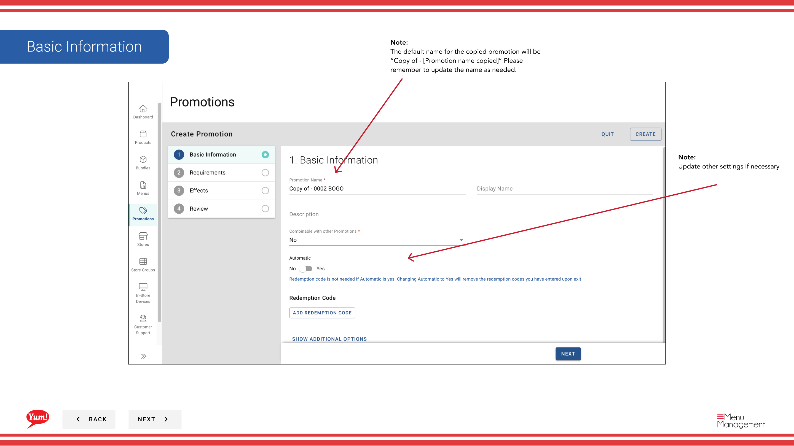

# プロモーションをコピーする

## このガイドで扱う内容

このガイドでは、Byte Commerce Admin Portal でプロモーションをコピーする手順を説明します。

## 手順

**ステップ 1:** まず、こちらをクリックして Promotions 画面に移動します。
**ステップ 2:** Find the promotion you’d like to copy, click the action ボタン, then click “Copy”

## 注意事項

:::note
The default name for the copied promotion will be “Copy of - [Promotion name copied]” Please remember to update the name as needed.
:::

:::note
Update other settings if necessary
:::

:::note
Update or add requirements if needed.
:::

:::note
Update or add effects if needed.
:::

:::note
Review Content
:::

## 追加情報

- This is the Promotions screen where you  will see a list of all the promotions you have created, create new promotions, search for any you have created, edit and copy, add extra info in the Meta link and  assign them to Store Groups.  Promotions can only assigned to a Store Group and not a singular store.
- Once you are done editing the promotion, click the “Create” button.
- プロモーション - プロモーションをコピーする

---

*[管理ポータルガイド](/docs/admin-portal-guide) の一部 · セクション: プロモーション*