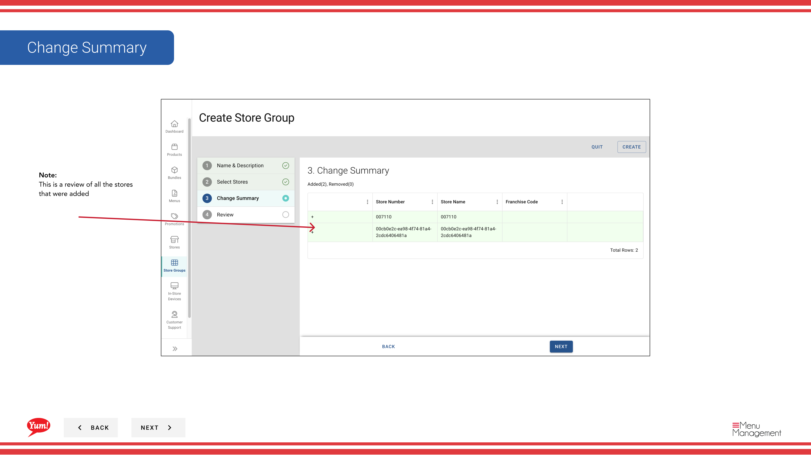

# ストアグループを作成する

## このガイドで扱う内容

このガイドでは、Byte Commerce Admin Portal でストアグループを作成する手順を説明します。

## 手順

**ステップ 1:** まず、こちらをクリックして Promotions 画面に移動します。
**ステップ 2:** the Store Groups tab をクリックします。

**ステップ 3:** the “Create New Store Group” ボタン をクリックします。

## 注意事項

:::note
There are multiple ways to create a store group. This is the way to do it through Promotions. You can also do it through Store Groups in the main navigation.
:::

## 追加情報

- プロモーション - ストアグループを作成する
- This is the Promotions screen where you  will see a list of all the promotions you have created, create new promotions, search for any you have created, edit and copy, add extra info in the Meta link and  assign them to Store Groups.  Promotions can only assigned to a Store Group and not a singular store.
- Give the new store group a distinct name to differentiate it with other store groups
- Use this tab to find and select stores you’d like associated with the new store group you are creating

---

*[管理ポータルガイド](/docs/admin-portal-guide) の一部 · セクション: プロモーション*