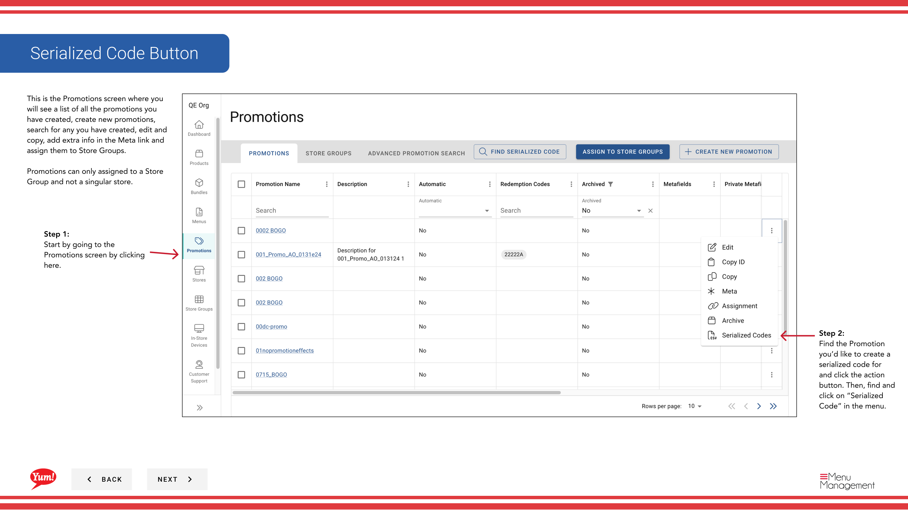

# シリアルコードを作成する

## このガイドで扱う内容

このガイドでは、Byte Commerce Admin Portal でシリアルコードを作成する手順を説明します。

## 手順

**ステップ 1:** まず、こちらをクリックして Promotions 画面に移動します。
**ステップ 2:** Find the Promotion you’d like to create a serialized code for and click the action ボタン. Then, find and click on “Serialized Code” in the menu.

**ステップ 3:** this ボタン to create a new serialized code for a promotion をクリックします。

**ステップ 4:** 入力します this form and hit generate codes for it to be created and added to the serialized code list.

## 追加情報

- Serialized Code Button
- This is the Promotions screen where you  will see a list of all the promotions you have created, create new promotions, search for any you have created, edit and copy, add extra info in the Meta link and  assign them to Store Groups.  Promotions can only assigned to a Store Group and not a singular store.
- プロモーション - シリアルコードを作成する

---

*[管理ポータルガイド](/docs/admin-portal-guide) の一部 · セクション: プロモーション*