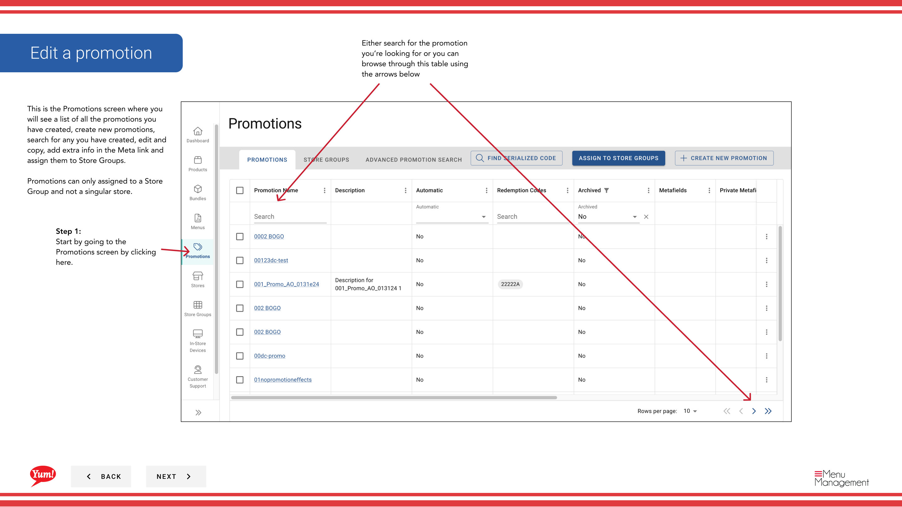
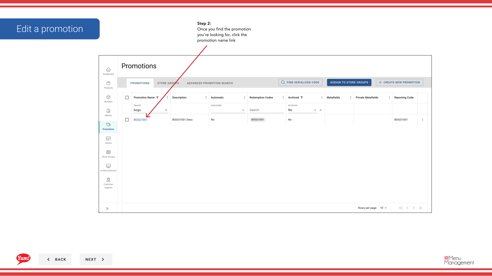

# プロモーションを編集する

## このガイドで扱う内容

このガイドでは、Byte Commerce Admin Portal でプロモーションを編集する手順を説明します。

## 手順

**ステップ 1:** まず、こちらをクリックして Promotions 画面に移動します。
**ステップ 2:** Once you find the promotion you’re looking for, click the promotion name link

## 追加情報

- Either search for the promotion you’re looking for or you can browse through this table using the arrows below
- This is the Promotions screen where you  will see a list of all the promotions you have created, create new promotions, search for any you have created, edit and copy, add extra info in the Meta link and  assign them to Store Groups.  Promotions can only assigned to a Store Group and not a singular store.
- You will be taken to the Promotion Wizard where you can edit any details.
- After making changes, remember to click the “Save” button before leaving the wizard.

---

*[管理ポータルガイド](/docs/admin-portal-guide) の一部 · セクション: プロモーション*