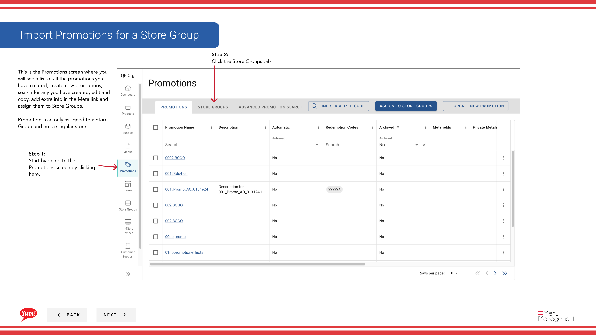

# ストアグループ向けプロモーションをインポートする

## このガイドで扱う内容

このガイドでは、Byte Commerce Admin Portal でストアグループ向けプロモーションをインポートする手順を説明します。

## 手順

**ステップ 1:** まず、こちらをクリックして Promotions 画面に移動します。
**ステップ 2:** the Store Groups tab をクリックします。

**ステップ 3:** Find the store group you want to receive promotions from another store group

**ステップ 4:** the Action ボタン then click on “Import Promotions” をクリックします。

**ステップ 5:** Search for the store group you want to import promotions from to copy over to the selected store group

**ステップ 6:** Save and the promotions will be imported をクリックします。

## 追加情報

- プロモーション - ストアグループ向けプロモーションをインポートする
- ストアグループ向けプロモーションをインポートする
- This is the Promotions screen where you  will see a list of all the promotions you have created, create new promotions, search for any you have created, edit and copy, add extra info in the Meta link and  assign them to Store Groups.  Promotions can only assigned to a Store Group and not a singular store.
- Review the recipient store group to make sure you are importing to the correct store group. Existing promotions linked to the recipient will be replaced and cannot be undone

---

*[管理ポータルガイド](/docs/admin-portal-guide) の一部 · セクション: プロモーション*