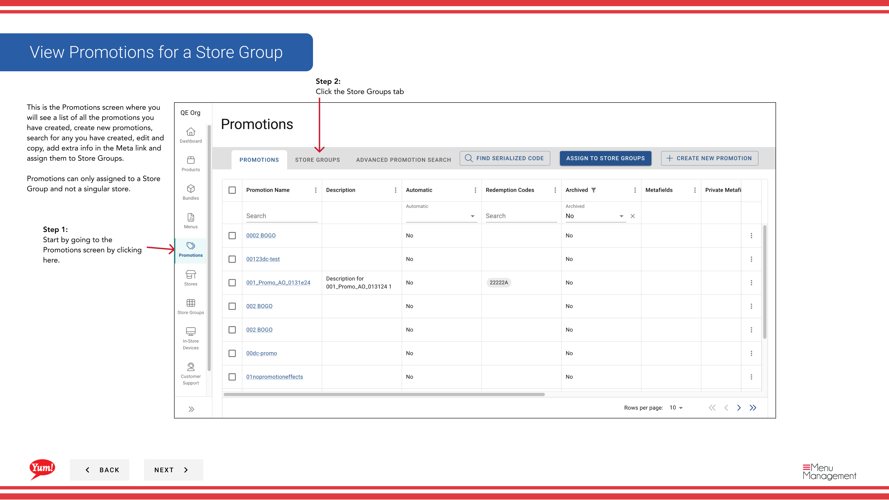
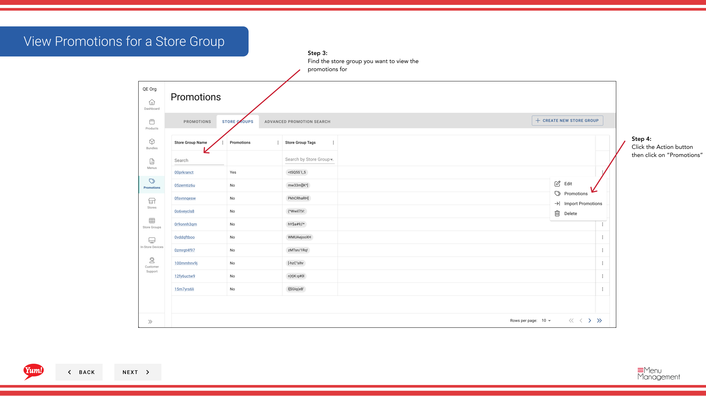

# ストアグループのプロモーションを確認する

## このガイドで扱う内容

このガイドでは、Byte Commerce Admin Portal でストアグループのプロモーションを確認する手順を説明します。

## 手順

**ステップ 1:** まず、こちらをクリックして Promotions 画面に移動します。
**ステップ 2:** the Store Groups tab をクリックします。

**ステップ 3:** Find the store group you want to view the promotions for

**ステップ 4:** the Action ボタン then click on “Promotions” をクリックします。

## 追加情報

- プロモーション - ストアグループのプロモーションを確認する
- ストアグループのプロモーションを確認する
- This is the Promotions screen where you  will see a list of all the promotions you have created, create new promotions, search for any you have created, edit and copy, add extra info in the Meta link and  assign them to Store Groups.  Promotions can only assigned to a Store Group and not a singular store.
- A drawer with all associated promotions will open.    If you need to unlink a promotion from the store group, click the “unlink” button

---

*[管理ポータルガイド](/docs/admin-portal-guide) の一部 · セクション: プロモーション*