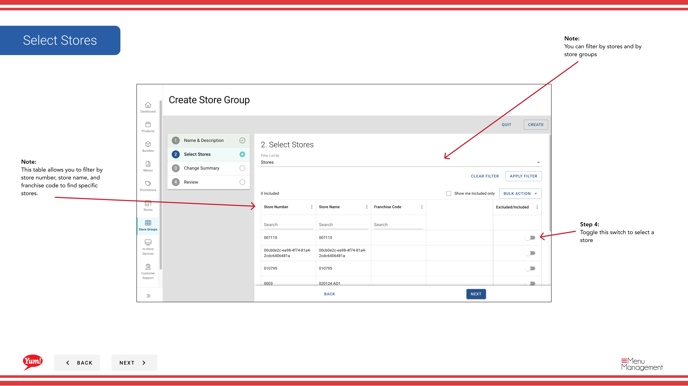

# ストアグループを作成する

## このガイドで扱う内容

このガイドでは、Byte Commerce Admin Portal でストアグループを作成する手順を説明します。

## 手順

**ステップ 1:** まず、こちらをクリックして Store Groups 画面に移動します。
**ステップ 2:** this ボタン to create a store group をクリックします。

**ステップ 3:** Type in the store group name for the store you want to create and enter any store group tags if needed.

**ステップ 4:** Toggle this switch to select a store

**ステップ 4:** Press this create ボタン when finished with each step to finally create your store group.

## 注意事項

:::note
You can filter by stores and by store groups
:::

:::note
This table allows you to filter by store number, store name, and franchise code to find specific stores.
:::

:::note
This is a review of all the stores that were added
:::

:::note
This is a review of all the actions you’ve done in each step: Store group name/tag, and store selection.
:::

## 追加情報

- Menu Management User Guide
- ストアグループ - ストアグループを作成する
- You can search by store group name and store group tags and see whether or not a store group has a tax association

---

*[管理ポータルガイド](/docs/admin-portal-guide) の一部 · セクション: ストアグループ*