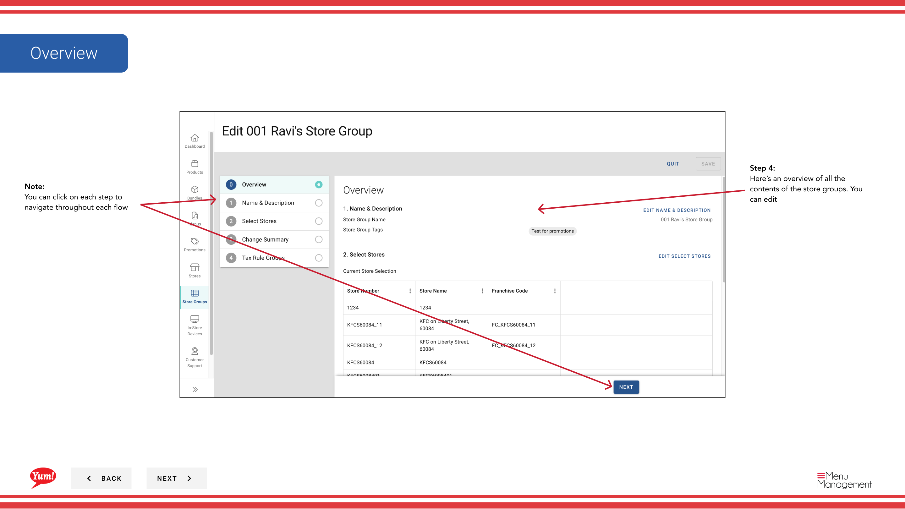
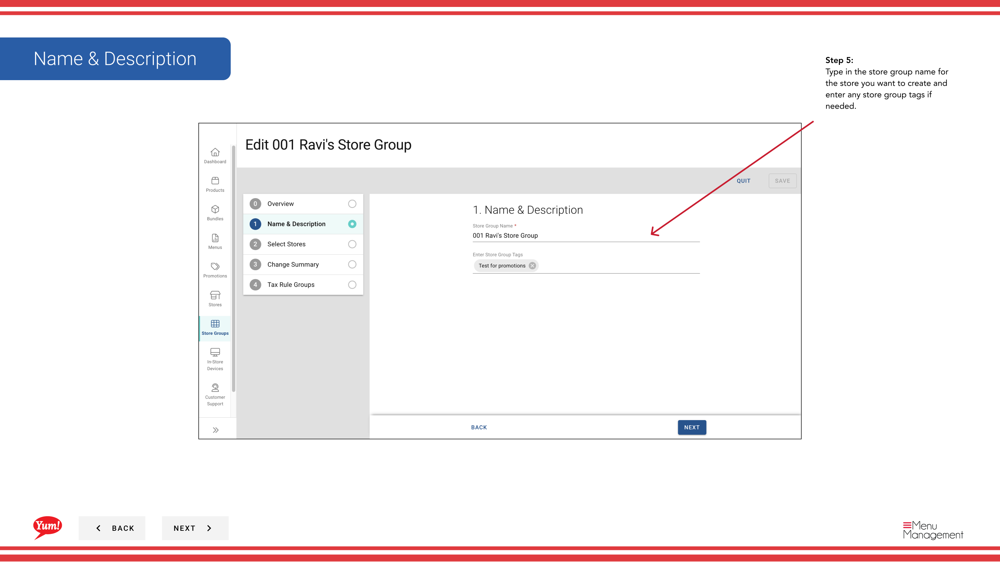

# ストアグループを編集する

## このガイドで扱う内容

このガイドでは、Byte Commerce Admin Portal でストアグループを編集する手順を説明します。

## 手順

**ステップ 1:** まず、こちらをクリックして Store Groups 画面に移動します。
**ステップ 2:** Once you find the store group you are looking for, click on the stacked dots to open the option window.

**ステップ 3:** on edit をクリックします。

**ステップ 4:** Here’s an overview of all the contents of the store groups. You can edit

**ステップ 5:** Type in the store group name for the store you want to create and enter any store group tags if needed.

**ステップ 6:** Toggle this switch to select a store

## 注意事項

:::note
You can click on each step to navigate throughout each flow
:::

:::note
This table allows you to filter by store number, store name, and franchise code to find specific stores.
:::

:::note
You can filter by stores and by store groups
:::

:::note
This is a review of all the stores that were added and removed during your session
:::

:::note
Here you can view all of the tax rules tied to the store group to edit the tax rules (add or remove rules) you will need to click the taxes button in the more kebab menu associated with the store group
:::

## 追加情報

- Menu Management User Guide
- ストアグループ - ストアグループを編集する
- You can search by store group name and store group tags and see whether or not a store group has a tax association

---

*[管理ポータルガイド](/docs/admin-portal-guide) の一部 · セクション: ストアグループ*