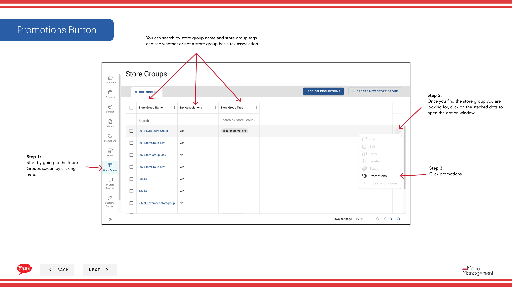
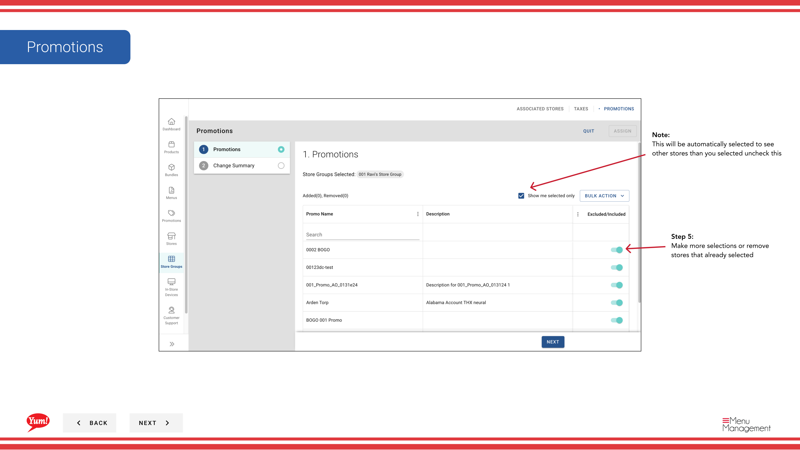

# プロモーションを編集する

## このガイドで扱う内容

このガイドでは、Byte Commerce Admin Portal でプロモーションを編集する手順を説明します。

## 手順

**ステップ 1:** まず、こちらをクリックして Store Groups 画面に移動します。
**ステップ 2:** Once you find the store group you are looking for, click on the stacked dots to open the option window.

**ステップ 3:** promotions をクリックします。

**ステップ 4:** Edit Promotions をクリックします。

**ステップ 5:** Make more selections or remove stores that already selected

**ステップ 6:** assign when finished (this will only be enabled after you make a change) をクリックします。

## 注意事項

:::note
Here you can see the stores you added or removed
:::

:::note
This will be automatically selected to see other stores than you selected uncheck this
:::

## 追加情報

- ストアグループ - プロモーションを編集する
- You can search by store group name and store group tags and see whether or not a store group has a tax association
- You can search promotion names in here

---

*[管理ポータルガイド](/docs/admin-portal-guide) の一部 · セクション: ストアグループ*