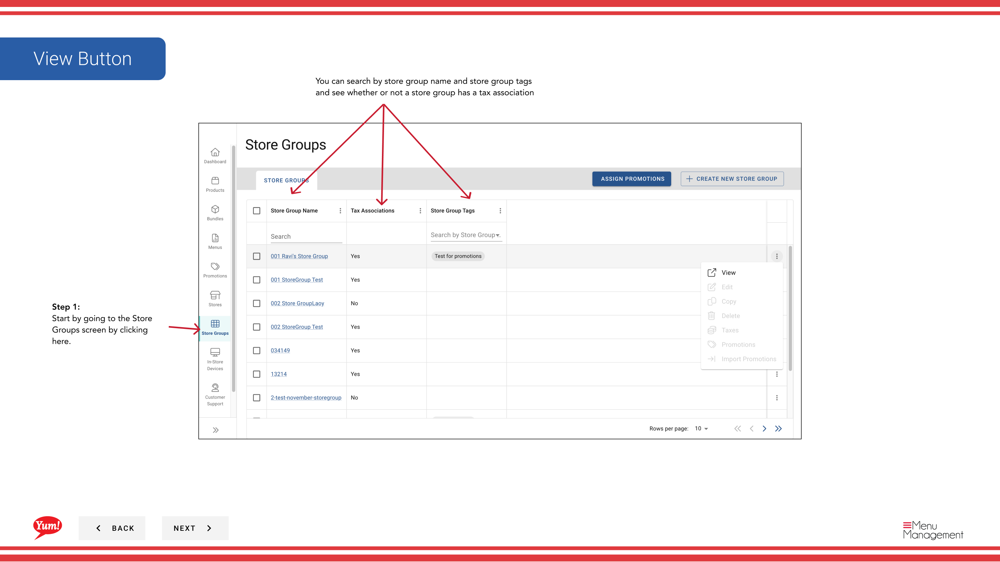

# ストアグループ内の店舗を確認する

## このガイドで扱う内容

このガイドでは、Byte Commerce Admin Portal でストアグループ内の店舗を確認する手順を説明します。

## 手順

**ステップ 1:** まず、こちらをクリックして Store Groups 画面に移動します。

## 注意事項

:::note
The table here list all the stores in the group you selected.
:::

## 追加情報

- Menu Management User Guide
- ストアグループ - ストアグループ内の店舗を確認する
- You can search by store group name and store group tags and see whether or not a store group has a tax association

---

*[管理ポータルガイド](/docs/admin-portal-guide) の一部 · セクション: ストアグループ*