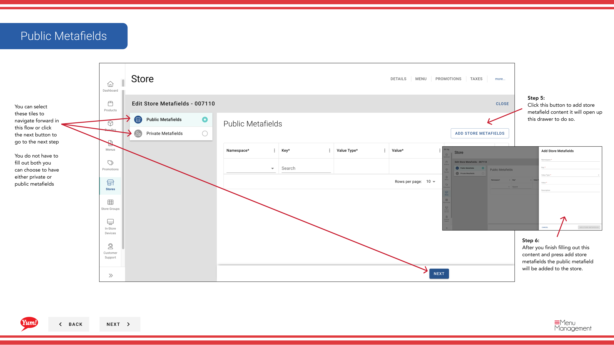

# メニューにメタフィールドを追加する

## このガイドで扱う内容

このガイドでは、Byte Commerce Admin Portal でメニューにメタフィールドを追加する手順を説明します。

## 手順

**ステップ 1:** まず、こちらをクリックして Stores 画面に移動します。

**ステップ 2:** 店舗は名称、番号、またはフランチャイズコードで検索できます。
**ステップ 3:** Once you find the store you are looking for, click on the stacked dots to open the option window.

**ステップ 4:** on Meta をクリックします。

**ステップ 5:** this ボタン to add store metafield content it will open up this drawer to do so をクリックします。

**ステップ 6:** After you finish filling out this content and press add store metafields the public metafield will be added to the store.

**ステップ 7:** this ボタン to add store metafield content it will open up this drawer to do so をクリックします。

**ステップ 8:** After you finish filling out this content and press add store metafields the private metafield will be added to the store.

## 注意事項

:::note
There are other options in the window  but for this step we are just looking at Meta. Others are discussed else where. Please go to the Table of Contents to find where.
:::

## 追加情報

- 店舗 - Add Metafields
- You can select these tiles to navigate forward in this flow or click the next button to go to the next step  You do not have to fill out both you can choose to have either private or public metafields

---

*[管理ポータルガイド](/docs/admin-portal-guide) の一部 · セクション: 店舗*