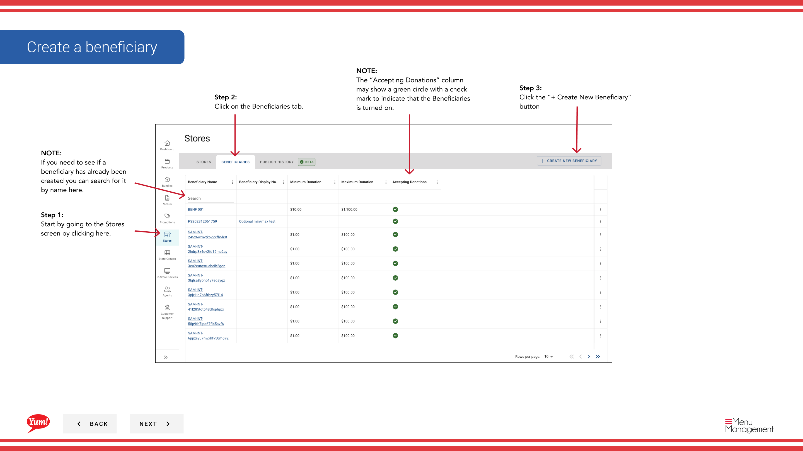

# 受益者を作成する

## このガイドで扱う内容

このガイドでは、Byte Commerce Admin Portal で受益者を作成する手順を説明します。

## 手順

**ステップ 1:** まず、こちらをクリックして Stores 画面に移動します。

**ステップ 2:** on the Beneficiaries tab をクリックします。
**ステップ 3:** the “+ Create New Beneficiary” ボタン をクリックします。

**ステップ 4:** each “*”必須項目 and other valuable information を入力します。

**ステップ 5:** To turn on the new beneficiary click the toggle to set it to Yes.

**ステップ 6:** Select/find from the dropdown the stores you would like to be a beneficiary.

**ステップ 7:** You can use the filter options to see if a store is a beneficiary when the list is long.

**ステップ 8:** 完了したら、the Create Beneficiary ボタン will become active to click and save your new beneficiary。

## 注意事項

:::note
If you need to see if a beneficiary has already been created you can search for it by name here.
:::

:::note
The “Accepting Donations” column may show a green circle with a check mark to indicate that the Beneficiaries is turned on.
:::

:::note
作業を中止する場合はここをクリックしてください。入力内容は保存されません。
:::

## 追加情報

- 店舗 - 受益者を作成する

---

*[管理ポータルガイド](/docs/admin-portal-guide) の一部 · セクション: 店舗*