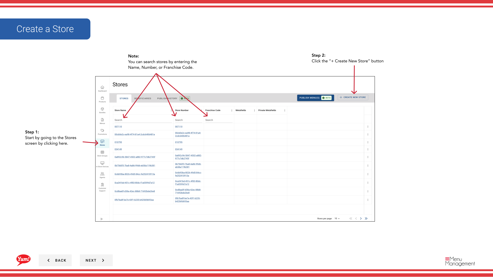

# 店舗を作成する

## このガイドで扱う内容

このガイドでは、Byte Commerce Admin Portal で店舗を作成する手順を説明します。

## 手順

**ステップ 1:** まず、こちらをクリックして Stores 画面に移動します。
**ステップ 2:** the “+ Create New Store” ボタン をクリックします。

**ステップ 3:** each “*”必須項目 and other valuable information を入力します。

**ステップ 4:** 完了したら、the Save ボタン will become active to click and save your new store.  That’s it,  you have created your store。

## 注意事項

:::note
店舗は名称、番号、またはフランチャイズコードで検索できます。
:::

:::note
作業を中止する場合はここをクリックしてください。入力内容は保存されません。
:::

## 追加情報

- 店舗 - 店舗を作成する

---

*[管理ポータルガイド](/docs/admin-portal-guide) の一部 · セクション: 店舗*