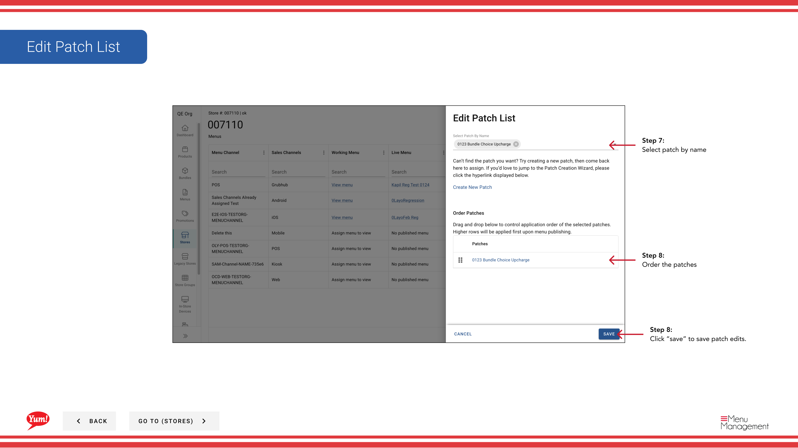

# パッチリストを編集する

## このガイドで扱う内容

このガイドでは、Byte Commerce Admin Portal でパッチリストを編集する手順を説明します。

## 手順

**ステップ 1:** まず、こちらをクリックして Stores 画面に移動します。

**ステップ 2:** 店舗は名称、番号、またはフランチャイズコードで検索できます。
**ステップ 3:** Once you find the store you are looking for, click on the stacked dots to open the option window.

**ステップ 4:** on Menus をクリックします。

**ステップ 6:** this more ボタン and then hit “Edit Patch List” をクリックします。

**ステップ 7:** patch by name を選択します。

**ステップ 8:** “save” to save patch edits をクリックします。

**ステップ 8:** Order the patches

## 注意事項

:::note
There are other options in the window  but for this step we are just looking at Menus. Others are discussed else where. Please go to the Table of Contents to find where.
:::

## 追加情報

- 店舗 - パッチリストを編集する

---

*[管理ポータルガイド](/docs/admin-portal-guide) の一部 · セクション: 店舗*