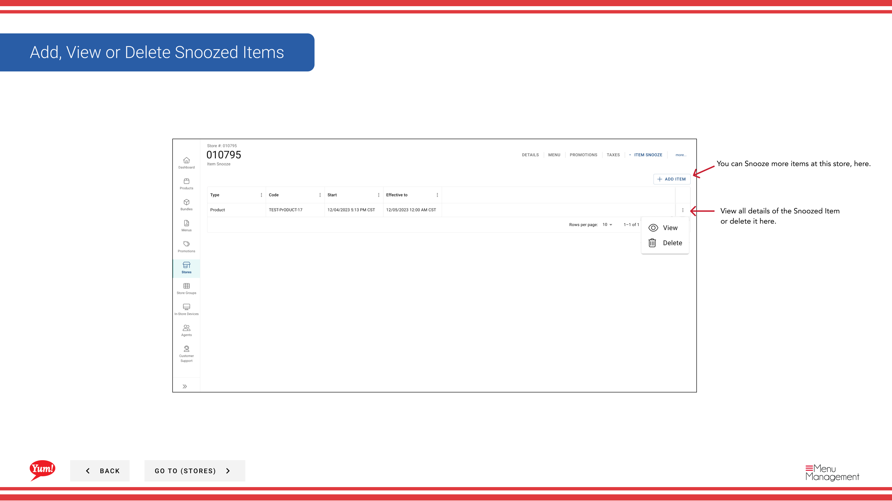

# 商品を一時停止する

## このガイドで扱う内容

このガイドでは、Byte Commerce Admin Portal で商品を一時停止する手順を説明します。

## 手順

**ステップ 1:** まず、こちらをクリックして Stores 画面に移動します。
**ステップ 2:** 店舗は名称、番号、またはフランチャイズコードで検索できます。

**Step 3a:** Once you find the store you are looking for, click on the stacked dots to open the option window.

**Step 3b:** If you are in the Store Edit screen click on “more...” to reveal the dropdown.

**Step 4a:** Click on Item Snooze.

**Step 4b:** Select Item Snooze

**ステップ 5:** “+ Add Item” をクリックします。

**ステップ 6:** Choose the Item Type you would like to snooze from the dropdown.

**ステップ 7:** Search for the item you need to snooze.

**ステップ 8:** Set your End Date.

**ステップ 9:** your reason from the dropdown を選択します。

**ステップ 10:** To start the snoozed item, click Save.

## 注意事項

:::note
There are other options in the window  but for this step we are just looking at Item Snooze. Others are discussed else where. Please go to the Table of Contents to find where.
:::

:::note
There are two paths to the Item Snooze  section. It depends on where you are in the flow for which path you will take, Step 3&4a or 3&4b.
:::

:::note
The Snooze date begins as soon as you click save. They can not be scheduled to start at a later date.
:::

:::note
If the Time Zone has not been set up for the store yet you will need do that here. If it has been this will be the only auto fill item in the set up.
:::

:::note
The “Add Details” field is Optional.
:::

:::note
作業を中止する場合はここをクリックしてください。入力内容は保存されません。
:::

## 追加情報

- 店舗 Screen (Skip Page If You’re Not On This Screen)を編集する
- Finish and snooze the item
- all details of the Snoozed Item or delete it here.を確認する
- You can Snooze more items at this store, here.

---

*[管理ポータルガイド](/docs/admin-portal-guide) の一部 · セクション: 店舗*