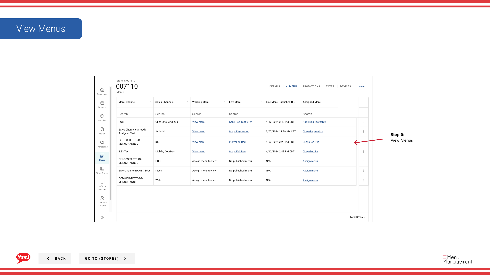

# a 店舗’s メニューを確認する

## 手順

**ステップ 1:** まず、こちらをクリックして Stores 画面に移動します。
**ステップ 2:** 店舗は名称、番号、またはフランチャイズコードで検索できます。

**ステップ 3:** Once you find the store you are looking for, click on the stacked dots to open the option window.

**ステップ 4:** on Menus をクリックします。

**ステップ 5:** View Menus

## 注意事項

:::note
There are other options in the window  but for this step we are just looking at Menus. Others are discussed else where. Please go to the Table of Contents to find where.
:::

---

*[管理ポータルガイド](/docs/admin-portal-guide) の一部 · セクション: 店舗*